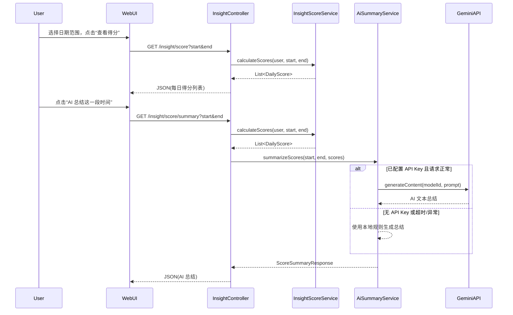

# Lattice-Planner 架构说明：插件化与概念隔离

本文档描述 **Lattice-Planner** 个人规划与任务管理系统的服务端架构。桌面客户端（Electron）通过 HTTP 访问本服务端，架构上为独立进程，见《软件设计说明书》第 9 章。

## 包结构

### 核心层（Core Layer）

核心层包含极简的业务实体和基础服务，不依赖任何插件。

```
core/
├── event/              # 事件定义
│   ├── TaskCompletedEvent.java
│   ├── TaskCreatedEvent.java
│   └── TaskArchivedEvent.java
└── service/            # 核心服务
    └── TaskService.java
```

**核心实体**（位于 `entity/`）：
- `Task` - 任务实体
- `Note` - 笔记实体
- `Link` - 弱关联实体
- `User` - 用户实体

**核心原则**：
- 核心层不依赖插件层
- 核心服务通过事件机制与插件解耦
- 核心实体保持极简，不包含业务扩展字段

### 插件层（Feature/Plugin Layer）

插件层通过事件监听扩展核心功能，不直接修改核心代码。

```
feature/
└── goal/               # 目标功能插件
    ├── entity/         # Goal 实体（插件层）
    ├── repository/     # GoalRepository
    ├── service/        # GoalService
    ├── controller/    # GoalController
    └── listener/      # GoalEventListener（事件监听器）
```

**插件原则**：
- 插件依赖核心，核心不依赖插件
- 通过事件监听扩展行为，而非直接修改核心代码
- 每个插件独立，互不依赖

## 事件驱动架构

### 事件发布

核心服务在关键操作时发布事件：

```java
// TaskService.java
public Task completeTask(Task task, User user) {
    task.setStatus(TaskStatus.DONE);
    Task saved = taskRepository.save(task);
    eventPublisher.publishEvent(new TaskCompletedEvent(saved, user));
    return saved;
}
```

### 事件监听

插件通过 `@EventListener` 监听事件并扩展行为：

```java
// GoalEventListener.java
@EventListener
public void onTaskCompleted(TaskCompletedEvent event) {
    // 可以在这里实现：更新目标进度、推荐笔记等
    // 未来扩展点，不污染核心代码
}
```

## 扩展新功能

### 添加新插件

1. 在 `feature/` 下创建新插件目录（如 `feature/insight/`）
2. 创建事件监听器监听核心事件
3. 实现插件特定的业务逻辑
4. 核心代码无需修改

### 示例：添加统计插件

```java
// feature/insight/listener/StatisticsEventListener.java
@Component
public class StatisticsEventListener {
    
    @EventListener
    public void onTaskCompleted(TaskCompletedEvent event) {
        // 更新统计信息
    }
    
    @EventListener
    public void onTaskCreated(TaskCreatedEvent event) {
        // 更新任务计数
    }
}
```

## 优势

1. **核心极简**：核心层保持最小化，易于理解和维护
2. **插件独立**：每个插件独立开发和部署
3. **易于扩展**：添加新功能只需新增监听器，不修改核心代码
4. **解耦设计**：核心与插件通过事件解耦，降低耦合度
5. **向后兼容**：核心层变更不影响插件层

## 当前实现

- ✅ 核心层：TaskService 事件发布
- ✅ 插件层：Goal 功能插件、Insight 插件（规划得分与 AI 总结）
- ✅ 事件系统：TaskCompletedEvent, TaskCreatedEvent, TaskArchivedEvent
- ✅ 事件监听：GoalEventListener
- ✅ 桌面端：Electron 客户端（Lattice-Planner 客户端），系统托盘、单实例、DDL 提醒（/due-dates + 桌面通知）

## 未来扩展

- 📋 统计插件（insight）：任务完成率、时间分析等
- 🤖 AI 插件（ai）：任务总结、笔记推荐等
- 📊 分析插件（analytics）：学习模式分析、目标聚类等

## Insight 模块与得分 / AI 总结架构补充

### 模块概览

在 Lattice-Planner 服务端的整体架构中，`feature/insight` 模块承担「分析与反馈层」的角色，负责从底层实体数据（任务、目标、笔记等）中提取信息，形成：

- 按日的规划得分（统计视图）
- 面向用户的自然语言总结（AI 总结）

其核心类包括：

- `InsightScoreService`：负责按日期区间计算每日规划得分
- `AiSummaryService`：负责基于一系列 `DailyScore` 生成文字总结（本地规则 + 外部 AI）
- `InsightController`：对外暴露统计与总结的接口（如 `/insight/score`、`/insight/score/summary`）

### 模块交互关系

整体调用链可以用如下时序图表示：



### 得分机制设计说明

#### 输入与输出

- 输入：
  - 任务（Task）：包括截止日期、状态、精力需求、心理负担、任务周期等
  - 目标（Goal）：包括进度、归档时间、关联任务
  - 笔记（Note）：包括创建时间、类型等
  - 链接（Link）：用于表达任务与目标、笔记之间的弱关联关系

- 输出：
  - 区间内按日聚合的 `DailyScore` 列表：
    - `date`：日期
    - `totalScore`：0–100 的总得分
    - `taskScore`、`goalScore`、`noteScore`：三个维度的分数
    - 其他统计辅助信息：计划任务数、完成任务数、目标进度、笔记数量等

#### 三大得分维度与权重

得分被设计为三个维度加权叠加，总分 0–100：

1. 任务维度（约 0–70 分）
   - 根据：
     - 加权完成率：每个任务权重由精力需求、心理负担、任务周期共同决定
     - 吞吐量因子：完成任务的权重总量通过一条带有边际递减的函数映射到分值
   - 设计意图：
     - 鼓励完成重要且难度较高的任务，而不是拆分大量微小任务刷分
     - 对「做完少量关键任务」给予足够肯定

2. 目标维度（约 0–20 分）
   - 根据：
     - 各目标的整体进度（对进度值做幂变换以强调中高进度）
     - 当天完成的目标数
     - 当天有推进的目标覆盖面（有多少不同目标被推进）
   - 设计意图：
     - 鼓励用户长期围绕几个核心目标持续推进
     - 防止只堆短期任务而忽略中长期成长

3. 笔记维度（约 0–10 分）
   - 根据当天笔记条数，通过递减增益函数映射到 0–10 分
   - 设计意图：
     - 鼓励用户写少量高质量复盘笔记
     - 避免通过重复记录碎片笔记来刷分

#### 其他设计要点

- 按截止日期归属：
  - 每条任务被归入其截止日期当日的统计中，而非完成日期
  - 有利于衡量「计划执行得如何」而非单纯的完成时间
- 按需计算，不落库：
  - `DailyScore` 仅作为 DTO 在内存中生成
  - 每次查看统计或 AI 总结时，会实时从底层实体重新聚合计算

### AI 总结机制设计说明

#### 职责与定位

`AiSummaryService` 负责对一段时间内的 `DailyScore` 列表进行语义层面的总结，在架构上起到以下作用：

- 把统计数据转换为自然语言洞察
- 对上层屏蔽具体 AI 提供方（本地规则 / 外部模型）的差异
- 提供稳定的接口给 `InsightController` 使用

#### 双通路设计

内部实现采用「本地规则 + 外部 AI」的双通路，保证在任何环境下都有可用结果：

1. 本地规则总结（始终可用）
   - 不依赖外部服务
   - 根据分数趋势、平均值、维度对比等简单规则生成一段人工设定模板的中文总结
   - 在以下情况会被直接使用：
     - 环境中没有可用的 API Key
     - 外部 AI 调用超时或出现异常

2. 外部 Gemini 调用（有条件启用）
   - 使用官方 `google-genai` SDK 与 Gemini 模型通信
   - 构造包含日期区间、每日得分与维度指标的 prompt 并发送给远程模型
   - 调用超时设定为约 8 秒，超时或异常会自动退回本地规则总结

通过该双通路设计，`AiSummaryService` 对上层调用者提供统一的 `ScoreSummaryResponse`，避免在控制器中出现复杂的错误处理与分支逻辑。

### 配置与扩展点

#### 外部依赖

- Gemini API：
  - 使用 `com.google.genai:google-genai` 依赖与 Google Gemini 通信
  - 默认模型 ID：`gemini-2.5-flash`（当前在代码中硬编码）

#### 配置项优先级

API Key 解析顺序为：

1. 应用配置文件：
   - `gemini.api.key`
2. 环境变量：
   - `GEMINI_API_KEY`
3. 兼容环境变量：
   - `GOOGLE_API_KEY`

任意一项存在且有效，即视为可用，`AiSummaryService` 会尝试启用外部 AI 调用；否则默认使用本地规则总结。

#### 建议的扩展方向

- 模型配置化：
  - 将当前硬编码的模型 ID（如 `gemini-2.5-flash`）提取为可配置项（如 `gemini.model.id`）
- 超时与重试策略配置化：
  - 将调用超时以及是否重试等策略提取为配置项，便于根据网络与部署环境调整
- 多语言支持：
  - 在配置中加入「默认总结语言」选项（如 `zh-CN`、`en-US`），以便未来支持多语言用户界面
- 持久化与导出：
  - 如需要长期趋势分析或导出功能，可增加得分结果的持久化表与相关导出接口
- 模型提供方多样化：
  - 在 `AiSummaryService` 周围增加一层「LLM Provider」抽象，支持除 Gemini 以外的其他模型无感切换

---

**说明**：更完整的系统设计（含运行环境、部署、桌面端、接口与数据设计）见项目 `docs/copyright/软件设计说明书.md`。

