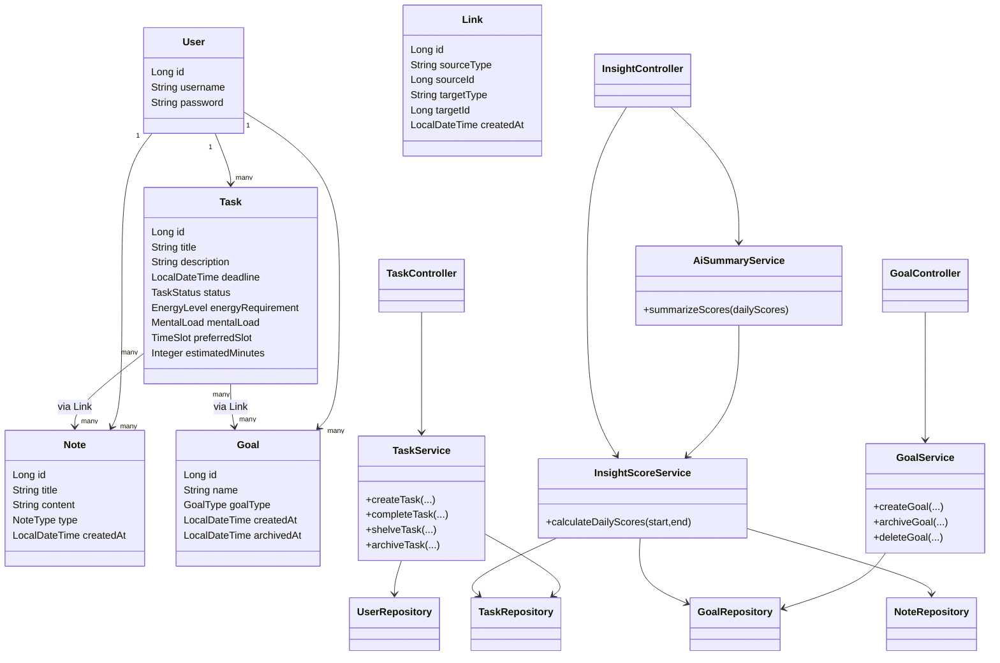
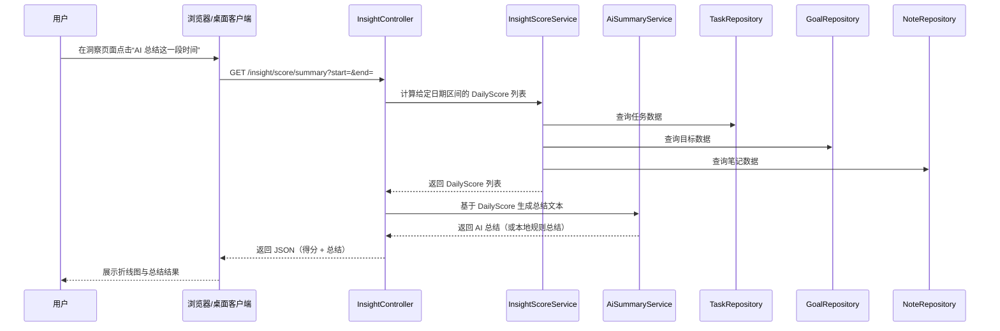

## Lattice-Planner 综合说明文档

**软件名称**：Lattice-Planner 
**当前版本**：V1.0.0

**源码地址**：https://github.com/zhzssp/Lattice-Planner.git

---

## 第 1 章 概述与基本信息

### 1.1 编写目的

本综合文档整合了原有的《软件简要说明》《软件设计说明书》《用户手册》《架构说明》等内容，去除了重复描述，形成一份完整、统一的说明文档。主要用于：

- 软件著作权登记时，作为「文档鉴别材料」与「软件简要说明」的依据。  
- 项目研发、测试、运维与后续维护时的参考。  

### 1.2 软件简介

Lattice-Planner 是一款面向个人的规划与任务管理软件，由**服务端 Web 应用**与可选的 **Windows Electron桌面客户端**组成。用户通过浏览器或桌面客户端访问服务端，完成注册与登录后，可在不同思维模式（执行 / 学习 / 规划）下，对任务、目标、笔记进行管理，并查看规划得分曲线与 AI 总结。桌面客户端在用户登录状态下可常驻系统托盘，定期检查任务截止时间并发送桌面通知提醒。

### 1.3 软件基本信息

- **软件全称**：Lattice-Planner 
- **软件简称**：Lattice
- **版本号**：V1.0.0  
- **开发完成日期**：【 2026-2-27 】  
- **首次发表日期**：【 未发表 】  
- **著作权人**：【 郑皓 】  

### 1.4 术语与简称

| 术语/简称 | 含义                                   |
| --------------------------------- | ------------------------------------ |
| DDL                               | 截止日期（Deadline）                       |
| 规划得分                              | 按日统计的任务、目标、笔记三维度综合得分（0–100）          |
| 思维模式                              | 执行（execute）、学习（learn）、规划（plan）三种使用模式 |
| 洞察                                | 规划得分曲线与 AI 总结等统计与反馈功能                |
| 核心层                               | 仅包含基础实体与服务的业务核心，不依赖插件                |
| 插件层                               | 通过事件监听扩展核心功能的功能模块（如目标、洞察）            |

---

## 第 2 章 软件用途与面向领域

### 2.1 软件用途

Lattice-Planner 是一款面向个人的规划与任务管理软件，用于帮助用户在「执行」「学习」「规划」等不同思维模式下，更有条理地安排与回顾工作与生活。主要用途包括：

1. **任务管理**：创建、完成、搁置、删除任务；设置截止日期、精力需求、心理负担、期望时间段；支持按关键词与日期范围搜索与筛选；支持按时间段或精力分组的视图切换。  
2. **目标管理**：创建与管理中长期目标，将任务关联到目标，归档已达成目标，并通过事件驱动机制自动更新目标进度。  
3. **笔记管理**：添加与查看笔记，支持多种笔记类型，用于复盘与知识积累。  
4. **用户偏好与思维模式**：设置每屏任务数、是否显示未来任务、是否显示统计信息等；在不同思维模式间切换，规划模式下可访问规划得分与 AI 总结。  
5. **规划得分与统计**：按日计算任务、目标、笔记三维度的规划得分（0–100），以折线图展示一段时间内的每日得分曲线。  
6. **AI 总结**：基于选定时间段的每日得分数据，自动生成自然语言总结与建议；在未配置外部模型时使用内置本地规则总结。  
7. **桌面端与 DDL 提醒**：通过 Electron 桌面客户端访问 Web 服务，系统托盘常驻、单实例运行；在用户登录状态下定期检查任务截止时间，对即将到期（1 天内、3 天内）或已过期的任务发送桌面通知提醒。  

### 2.2 面向领域 / 行业

本软件属于**个人效率工具与任务管理**领域，适用于个人在学习、工作与生活等场景下进行任务规划、目标管理、笔记记录与复盘分析，可作为通用任务管理与个人规划支持软件使用。

---

## 第 3 章 环境说明

### 3.1 服务端运行环境

- **操作系统**：Windows / Linux / macOS 等支持 JDK 的平台。  
- **Java 运行环境**：JDK 21。  
- **数据库**：MySQL 8.x；需预先创建数据库（如 `memo_db`），并在应用配置中填写连接地址、用户名、密码及时区等参数。  
- **可选依赖**：若需使用 AI 总结的在线模型，需配置 Gemini API Key（配置文件或环境变量）；否则，软件使用默认的统计分析总结。  

### 3.2 Web 端运行环境

- **浏览器**：Chrome、Edge、Firefox、Safari 等支持 HTML5 与 JavaScript 的现代浏览器。  
- **网络**：能够访问 Lattice-Planner 服务端部署地址（如 `http://localhost:8080` 或生产环境域名）。  

### 3.3 桌面端运行环境

- **操作系统**：Windows 10/11（当前提供 Windows x64 构建）。  
- **运行方式**：通过 Electron 打包的安装包或绿色包运行，无需单独安装 JDK。  
- **依赖**：需先启动 Lattice-Planner 服务端，桌面端通过配置的 `BASE_URL`（默认 `http://localhost:8080`）访问；可通过环境变量 `ELECTRON_APP_BASE_URL` 修改。  

### 3.4 开发环境与工具

- 操作系统：Windows 11 64 位 PC（x86_64）。  
- 开发工具：IntelliJ IDEA / VS Code 等。  
- 编程语言：Java、HTML/CSS/JavaScript。  
- 构建与依赖管理：Gradle、Spring Boot。  
- 数据库：MySQL（本地或远程实例，需要在application.properties手动配置地址）。  
- 版本管理：Git。  

### 3.5 环境配置与启动步骤

本节给出**从零开始**配置环境并启动 Lattice-Planner 服务端的完整步骤。

#### 3.5.1 前置软件安装

1. 安装 **JDK 21**（64 位），并确认命令行执行 `java -version` 输出版本为 21。  
2. 安装 **MySQL 8.x**：  
   - 启动 MySQL 服务。  
   - 记录数据库登录账号与密码（如：用户名 `root`，密码 `123456`）。  
3. 准备一台可访问互联网或局域网的 Windows / Linux / macOS 电脑，用于运行服务端与浏览器访问。  

> 若只验证 Web 功能，无需安装桌面客户端，使用浏览器访问即可。

#### 3.5.2 创建数据库

使用 MySQL 客户端或图形工具（如 MySQL Workbench），执行以下 SQL 创建数据库：

```sql
CREATE DATABASE memo_db
  DEFAULT CHARACTER SET utf8mb4
  DEFAULT COLLATE utf8mb4_unicode_ci;
```

如需使用其他数据库名，可自行替换，但需与第 3.5.3 节中的配置保持一致。

#### 3.5.3 配置应用参数（application.properties）

在源码根目录下找到文件：  
`src/main/resources/application.properties`  

根据实际环境修改以下配置项（示例为本地 MySQL，用户名 root、密码 123456）：

```properties
spring.datasource.url=jdbc:mysql://localhost:3306/memo_db?useSSL=false&serverTimezone=UTC&allowPublicKeyRetrieval=true
spring.datasource.username=root
spring.datasource.password=123456

# 如需修改 Web 端口，可取消下一行注释并调整端口号：
# server.port=8080
```

可选：若需启用在线 AI 总结（调用 Google Gemini 模型），还需配置 API Key，二选一或同时设置（任一生效）：

```properties
# 方式一：在配置文件中设置
gemini.api.key=YOUR_API_KEY_HERE
```

或在运行环境中设置下列环境变量之一：

- `GEMINI_API_KEY=YOUR_API_KEY_HERE`  
- `GOOGLE_API_KEY=YOUR_API_KEY_HERE`  

未配置 API Key 时，系统会自动使用本地规则生成总结，不影响功能验证。

#### 3.5.4 构建并启动服务端（Gradle）

假定源码已经放置在某一目录（例如 `E:\Lattice-Planner`），并已安装 Gradle 或使用项目内置的 Gradle Wrapper。

1. 打开命令行（Windows 可使用 PowerShell 或 CMD）。  
2. 切换到项目根目录，例如：  

```bash
cd E:\Lattice-Planner
```

3. 使用 Gradle 构建可执行 JAR 包：  

```bash
# 方式一：使用项目自带的 Gradle Wrapper（推荐）
# Windows
.\gradlew.bat clean bootJar

# Linux / macOS
./gradlew clean bootJar

# 方式二：若本机已安装 Gradle，也可以在项目根目录执行
gradle clean bootJar
```

执行成功后，会在项目根目录下生成 `build/libs/` 目录，其中包含一个以项目名和版本号命名的 JAR 文件，文件名类似：  

```text
build/libs/Lattice-Planner-0.0.1-SNAPSHOT.jar
```

（实际名称以生成结果为准，可直接在 `build/libs/` 目录查看。）

4. 运行生成的 JAR 包：  

在命令行中保持当前目录为项目根目录，执行：  

```bash
java -jar build/libs/【实际生成的 JAR 文件名】
```

例如：  

```bash
java -jar build/libs/Lattice-Planner-0.0.1-SNAPSHOT.jar
```

启动成功后，命令行中会出现类似 “Started MemorandumApplication ...” 的日志，且无明显错误堆栈，此时服务端已在指定端口（默认 8080）监听，可用浏览器访问。

#### 3.5.5 通过浏览器验证服务是否启动成功

1. 在运行服务端的同一台机器上打开浏览器（Chrome/Edge/Firefox 均可）。  
2. 在地址栏输入（若未修改端口）：  

```text
http://localhost:8080
```

或直接访问登录页：  

```text
http://localhost:8080/login
```

3. 页面正常加载登录界面，说明服务端启动成功、数据库连接正常。  
4. 若访问失败，请检查：  
   - 服务端命令行是否仍在运行，有无报错；  
   - `application.properties` 中数据库地址、用户名、密码是否正确；  
   - 防火墙或安全软件是否拦截端口（本地访问一般无此问题）。  

#### 3.5.6 打包并通过桌面客户端访问系统（Electron）

在确认服务端能够通过浏览器正常访问后，如需体验桌面端及 DDL 提醒功能，可按下列步骤打包并运行 Electron 客户端。

1. **准备客户端工程与 Node.js 环境**  
   
   - 已安装 **Node.js 18+ 与 npm**。  
   - 已获取本项目的 **Electron 桌面客户端工程源码**（例如作为仓库中的单独子工程，具体路径以实际代码结构为准）。  

2. **在客户端工程目录安装依赖**  
   
   - 打开命令行，切换到 Electron 客户端工程根目录。  
   
   - 执行依赖安装命令（以 `package.json` 为准，典型示例）：  
     
     ```bash
     npm install
     ```

3. **开发模式下验证客户端可用性（可选）**  
   
   - 在客户端工程目录执行：  
     
     ```bash
     npm start
     ```
   
   - Electron 窗口启动后，会在内嵌浏览器中打开配置的服务端地址（默认 `http://localhost:8080`），界面与浏览器访问效果一致。  

4. **打包生成桌面客户端安装包或可执行文件**  
   
   - 根据 `package.json` 中的脚本配置执行打包命令，例如：  
     
     ```bash
     npm run pack
     # 以及
     npm run dist
     ```
   
   - 打包完成后，会在 `dist` 等输出目录下生成 **Windows x64 安装包或绿色版可执行文件**（如 `Lattice-Planner-Client-Setup.exe` 或 `Lattice-Planner-Client.exe`），具体名称以打包结果为准。  

5. **配置客户端访问的服务端地址**  
   
   - 若服务端部署在本机，且端口为默认的 `8080`，一般可直接使用内置默认地址 `http://localhost:8080`。  
   
   - 若需连接远程服务器或修改端口，可通过环境变量 `ELECTRON_APP_BASE_URL` 指定，例如：  
     
     ```bash
     # Windows PowerShell 示例
     $env:ELECTRON_APP_BASE_URL = "http://your-server-host:8080"
     ```
   
   - 也可以按客户端工程中的说明，在其配置文件或启动参数中调整基础地址（以实际实现为准）。  

6. **通过桌面客户端访问并验证 DDL 提醒**  
   
   - 用户执行安装包或直接运行绿色版可执行文件，启动 Lattice-Planner 客户端。  
   - 首次启动时，客户端会加载配置的服务端 URL，展示登录界面；登录后进入任务看板等页面，使用方式与浏览器基本一致。  
   - 在用户保持登录状态且客户端最小化到托盘时，客户端会定期调用服务端接口检查任务截止时间，对「已过期」「1 天内截止」「3 天内截止」的任务发送桌面通知提醒（同一任务一天内只提醒一次）。  

#### 3.5.7 功能验证建议

在服务端成功启动，并能通过浏览器访问后，可按以下最小路径验证核心功能：

1. **注册与登录**  
   - 在登录页选择「注册」（如开放注册），创建一个新账号。  
   - 使用新账号登录，进入默认看板或功能选择页面。  
2. **任务管理**  
   - 创建 1～2 条任务，设置不同的截止日期与精力需求。  
   - 将其中一条任务标记为完成，观察看板展示是否更新。  
3. **目标与任务关联**  
   - 创建一个目标，在创建或编辑任务时将任务关联到该目标。  
   - 完成任务后，可在目标界面查看进度变化（若实现了相关统计）。  
4. **笔记与规划得分**  
   - 创建一两条笔记。  
   - 进入「洞察 / 统计」页面，选择包含今日在内的日期区间，查看规划得分折线图是否正常显示。  
5. **AI 总结（如已配置 API Key）**  
   - 在同一统计页面点击「AI 总结这一段时间」，等待数秒，检查是否返回一段总结文字。  
   - 未配置 API Key 时，会使用本地规则总结，同样会显示文本。  

完成以上步骤，即可确认系统从环境配置到关键功能均可正常运行。

---

## 第 4 章 系统总体设计

### 4.1 系统组成

Lattice-Planner 由以下三部分组成：

1. **服务端**：基于 Spring Boot 的 Web 应用，提供用户认证、任务/目标/笔记的增删改查、用户偏好管理、思维模式与功能选择、规划得分计算、AI 总结接口等；数据持久化采用 JPA/Hibernate + MyBatis（部分复杂查询）。  
2. **Web 前端**：服务端内嵌的 HTML/CSS/JavaScript 页面与静态资源，通过服务端模板渲染（如 Thymeleaf）与 REST 接口配合，实现登录、看板、任务/目标/笔记管理、偏好设置、洞察（得分曲线与 AI 总结）等界面。  
3. **桌面客户端（Lattice-Planner 客户端）**：基于 Electron 的桌面应用，内嵌浏览器加载服务端 URL，提供系统托盘、单实例、窗口隐藏到托盘、定时检查登录状态与任务截止日期并发送桌面通知等功能。  

### 4.2 总体架构原则

- **核心与插件解耦**：核心层仅包含用户、任务、笔记、链接等实体及任务基础服务，不依赖任何业务插件；扩展功能（目标、洞察）通过 Spring 事件监听实现，核心通过发布事件与插件交互。  
- **前后端一体部署**：Web 前端与后端同工程部署，减少跨域与部署复杂度；桌面端通过同一后端地址访问，会话通过 Cookie 保持。  
- **可扩展性与维护性**：通过事件驱动与插件机制，支持在不修改核心代码的前提下添加新功能模块。  

### 4.3 技术选型概览

| 层次    | 技术                                           |
| ----- | -------------------------------------------- |
| 服务端框架 | Spring Boot、Spring MVC、Spring Security       |
| 数据访问  | JPA/Hibernate、MyBatis（部分）                    |
| 数据库   | MySQL                                        |
| 前端    | HTML、CSS、JavaScript，服务端模板渲染                  |
| 桌面端   | Electron、Node.js、Axios                       |
| 可选 AI | Google Gemini API（`google-genai` SDK），本地规则兜底 |

---

## 第 5 章 核心层与插件层架构

本章整合了原《架构说明（ARCHITECTURE.md）》与《软件设计说明书》中关于核心与插件层的内容，避免重复。

### 5.1 包结构概览

整体包结构遵循「核心层 + 插件层」的设计思路：

- **核心层（core）**：  
  
  - `entity`：User、Task、Note、Link 及与任务相关的枚举（TaskStatus、EnergyLevel、MentalLoad、TimeSlot、TaskGranularity、NoteType 等）。  
  - `core/event`：TaskCreatedEvent、TaskCompletedEvent、TaskArchivedEvent，在任务创建、完成、归档时由核心服务发布。  
  - `core/service`：TaskService，负责任务的创建、完成、搁置、归档及事件发布。  
  - `repository`：TaskRepository、UserRepository、NoteRepository、LinkRepository 等数据访问接口。  

- **插件层（feature）**：  
  
  - `feature/goal`：目标管理插件，负责中长期目标及其与任务的关联。  
  - `feature/insight`：洞察插件，负责规划得分计算与 AI 总结。  

核心原则：

- 插件依赖核心，核心不依赖插件。  
- 插件通过 `@EventListener` 监听核心事件扩展行为，而非直接修改核心代码。  
- 各插件之间独立，互不依赖。  

### 5.2 核心实体说明

- **User**：用户实体，主要属性包括 id、username（唯一）、password（加密后存储）。  
- **Task**：任务实体（表名兼容为 `memo`），主要属性包括：  
  - `title`、`description`、`deadline`（截止时间）、`status`（PENDING/DONE/SHELVED 等）、`granularity`、`energyRequirement`（精力需求）、`mentalLoad`（心理负担）、`preferredSlot`（期望时间段）、`estimatedMinutes`、`createdAt`、`shelvedAt`、`user` 等。  
  - 任务在规划得分统计中按 `deadline` 的日期归属到对应天。  
- **Note**：笔记实体，属性包括 id、title、content、type、createdAt、updatedAt、user 等。  
- **Link**：弱关联实体，用于表达多对多关系。属性包括 sourceType/sourceId、targetType/targetId、createdAt，用于表示任务与目标、任务与笔记等关联。  

### 5.3 事件驱动机制

核心服务在关键操作时发布领域事件，插件通过监听事件扩展行为而不修改核心代码：

- 任务创建：TaskService 保存任务后发布 `TaskCreatedEvent`。  
- 任务完成：TaskService 将任务状态置为 DONE 并保存后发布 `TaskCompletedEvent`。  
- 任务归档：TaskService 归档后发布 `TaskArchivedEvent`。  

事件对象携带任务实体及操作用户等信息，供 Goal、Insight 等插件使用。  

### 5.4 目标插件（feature/goal）

- **实体**：Goal，属性包括 id、name、goalType、createdAt、archivedAt、user 等。  
- **Repository**：GoalRepository。  
- **Service**：GoalService，负责目标的创建、归档、删除及与任务的关联维护。  
- **Controller**：GoalController，提供目标管理的 Web 接口。  
- **Listener**：GoalEventListener，监听任务相关事件，更新目标进度或做后续统计扩展。  

任务与目标的关联通过 Link 表或任务表中关联字段实现，目标进度由插件根据关联任务的完成情况计算。

### 5.5 洞察插件（feature/insight）

洞察插件提供规划得分计算与 AI 总结，不修改核心数据模型，仅读取任务、目标、笔记、链接等数据：

- **InsightScoreService**：  
  
  - 按日期区间计算每日规划得分，输入为当前用户、起始日、结束日；输出为 `DailyScore` 列表（字段包括 `date`、`totalScore`、`taskScore`、`goalScore`、`noteScore` 等）。  
  - 任务维度（约 0–70 分）：按任务截止日期归属，根据精力需求、心理负担、任务周期等计算权重，再结合完成情况与吞吐量因子得到得分。  
  - 目标维度（约 0–20 分）：根据目标整体进度、当日完成目标数、当日有推进的目标数等计算。  
  - 笔记维度（约 0–10 分）：根据当日笔记条数经递减增益函数映射。  
  - 得分按需计算，不持久化。  

- **AiSummaryService**：  
  
  - 对给定日期区间内的 `DailyScore` 列表生成自然语言总结。  
  - 采用「本地规则 + 外部 AI」双通路：优先使用配置的 Gemini API 生成总结；无 API Key 或调用超时/异常时，使用本地规则模板生成总结。  

- **InsightController**：  
  
  - 提供接口 `GET /insight/score?start=&end=` 返回指定日期区间内每日得分列表。  
  - 提供接口 `GET /insight/score/summary?start=&end=` 返回该区间的 AI 总结。  

### 5.6 核心类与交互关系 UML 图

本节以 UML 形式给出 Lattice-Planner 中**核心实体类、服务类、控制器与仓储之间的关系**，以便在软著申请材料中直观展示软件内部结构与调用关系。

#### 5.6.1 核心类关系



其中：

- `User`、`Task`、`Note`、`Goal`、`Link` 为核心实体，用户与任务/笔记/目标之间是一对多关联，任务与目标、任务与笔记之间通过 `Link` 表达多对多关系。  
- `TaskService` 属于核心层服务，负责任务的创建、完成、搁置与归档，并发布任务相关领域事件。  
- `GoalService`、`InsightScoreService`、`AiSummaryService` 属于插件层服务，分别负责目标管理与进度统计、规划得分计算与 AI 总结生成。  
- 各类 `Repository`（仓储）负责与数据库的持久化交互。  
- `TaskController`、`GoalController`、`InsightController` 为 Web 控制器，响应来自浏览器或桌面客户端的 HTTP 请求。  

#### 5.6.2 典型交互流程（AI 总结调用时序图）

下面给出当用户在洞察页面点击「AI 总结这一段时间」时，前端、控制器、服务与仓储之间的**典型交互时序**：



通过上述 UML 类图与时序图，可以直观体现本软件中**核心类之间的结构关系与典型交互过程**。

---

## 第 6 章 功能说明与用户操作

### 6.1 系统入口与思维模式

- 用户可通过浏览器访问服务端 URL（如 `http://localhost:8080`），或通过桌面客户端打开同一地址。  
- 首次使用时，系统会引导选择思维模式：  
  - **执行模式**：偏向执行待办任务。  
  - **学习模式**：强调学习任务与积累。  
  - **规划模式**：专注于规划与复盘，提供规划得分与 AI 总结。  
- 登陆后可在导航或设置处随时切换模式。部分功能（如规划得分曲线、AI 总结）仅在规划模式下显示。  

### 6.2 任务管理

#### 6.2.1 创建任务

用户可在「今日任务看板」或「任务」页面点击「新建任务」进入任务表单，填写以下信息：

- 标题（必填）与描述。  
- 截止日期（Deadline）：决定该任务归属哪一天的规划得分统计。  
- 精力需求（Energy Level）：如高 / 中 / 低，影响任务权重。  
- 心理负担（Mental Load）：如沉重 / 较轻等，影响任务权重。  
- 期望时间段（Preferred Slot）：如上午 / 下午 / 晚上，用于视图展示。  
- 关联目标（可选）：将任务绑定到既有目标。  

#### 6.2.2 管理任务

在看板或任务列表中，用户可以：

- 标记任务为完成（Done）：计入对应截止日期当天的完成任务统计。  
- 搁置任务（Shelve）：暂时从当前视图移除，不计为完成。  
- 删除任务：彻底移除任务记录。  
- 搜索 / 筛选任务：按关键词、日期范围等筛选。  
- 切换视图：按时间段或精力分组查看任务。  

### 6.3 目标与笔记管理

#### 6.3.1 目标管理

在「目标」页面，用户可以：

- 创建目标：为中长期计划添加明确的目标（如完成课程、整理仓库）。  
- 归档目标：目标达成后进行归档。  
- 删除目标：删除不再需要的目标。  

此外，系统还提供**目标-任务树视图**（Goal-Task Tree）：

- 在支持该视图的页面（如规划相关视图）中，以树状结构展示用户的根目标、子目标及其下关联的任务节点。  
- 用户可以展开 / 收起各级节点，从上到下查看「目标 → 子目标 → 任务」的层级关系，帮助理解当前任务布局是否与长期目标匹配。  

任务与目标的关联影响：

- 目标进度：由关联任务的完成情况估算。  
- 得分：当天完成目标数量及有推进的目标覆盖面都会对目标维度得分产生影响。  

#### 6.3.2 笔记管理

在「笔记」页面，用户可以：

- 添加笔记：记录想法、复盘与知识点。  
- 查看笔记：按列表选择并查看具体内容。  

笔记与得分的关系：

- 当天的笔记条数会带来一定的加分，采用递减增益函数，2～4 条左右即可接近满分，防止刷分。  

### 6.4 用户偏好与界面设置

用户可在「偏好设置 / 用户设置」页面调整个人使用偏好：

- **通用设置**：界面主题（亮/暗）、默认思维模式等。  
- **按模式设置**：  
  - 每屏最多显示任务数。  
  - 是否显示未来任务。  
  - 是否显示统计信息（决定规划模式下是否展示得分与 AI 总结入口）。  
  - 默认任务视图（今日/时间段/精力）。  
  - 是否显示目标区块、归档区块、模糊任务提示等。  

### 6.5 规划得分与统计视图

在「洞察 / 统计」页面，用户可以：

- 选择日期区间（默认最近 14 天）。  
- 查看每日规划得分折线图，得分范围为 0–100。  
- 根据任务、目标、笔记三个维度了解每天的完成情况与平衡程度。  

得分构成与设计意图：

1. **任务维度（0–70 分）**：综合任务权重与完成情况，鼓励完成高精力、长期目标相关的关键任务。  
2. **目标维度（0–20 分）**：根据目标进度、当天完成目标数及有推进目标覆盖面，鼓励长期围绕核心目标持续推进。  
3. **笔记维度（0–10 分）**：根据当天笔记条数给予加分，鼓励适度复盘与记录。  

任务按截止日期归属到对应日期的得分统计中，得分数据不落库，每次查看时实时计算。  

### 6.6 AI 总结

在规划得分页面，用户可点击「AI 总结这一段时间」，系统会基于所选日期区间内的每日得分，生成自然语言总结，包括：

- 总体得分趋势（上升、波动或下滑）。  
- 三个维度的表现分析。  
- 接下来一段时间的建议。  

实现方式：

- 若环境中配置了有效的 Gemini API Key，则优先使用远程模型生成总结。  
- 若未配置或调用失败/超时，则回退到本地规则生成总结。  

用户体验上，无论是否有外部 AI，都会获得总结结果。  

### 6.7 桌面客户端与 DDL 提醒

桌面客户端提供以下特性：

- **托盘常驻与单实例**：关闭窗口后隐藏到托盘，右键托盘图标可退出；若已有实例运行，再次启动只会激活已有窗口。  
- **连接服务端**：默认访问 `http://localhost:8080`，可通过环境变量 `ELECTRON_APP_BASE_URL` 指定其他地址。  
- **DDL 提醒**：定期请求 `/user-logged-in` 与 `/due-dates` 接口：  
  - 对「已过期」「1 天内截止」「3 天内截止」的未完成任务发送桌面通知。  
  - 同一任务在同一天内只提醒一次。  

---

## 第 7 章 安全、接口与数据设计概览

为避免与设计说明书中详细章节重复，本章保留关键点，供软著与总体理解使用。

### 7.1 用户与安全

- 使用 Spring Security 进行用户认证与授权。  
- 登录方式为表单登录：`/login` 与 `/register` 提供登录与注册功能。  
- 密码采用 BCrypt 加密后存储在数据库中。  
- 会话基于 HTTP Session，Cookie 名为 `JSESSIONID`，Web 与桌面端共用同一会话机制。  
- 访问控制：  
  - 匿名可访问：登录/注册页、静态资源、`/user-logged-in` 等。  
  - 需认证访问：任务/目标/笔记、洞察、偏好设置等业务接口。  
  - `/due-dates` 接口供桌面端使用，免 CSRF，但仍依赖 Cookie 会话标识用户。  

### 7.2 主要接口概览

- 认证相关：`GET/POST /login`，`GET/POST /register`，`GET /user-logged-in`。  
- 任务相关：`GET /dashboard` 与 `/memo/*` 路径下的任务增删改查接口；`GET /due-dates` 拉取待提醒任务。  
- 目标与笔记：相关路径下的创建、列表、归档/删除、查看与编辑接口。  
- 洞察：`GET /insight/score`、`GET /insight/score/summary`。  
- 偏好与功能选择：读取与保存用户偏好、切换思维模式、获取目标-任务树（`GET /api/goal-task-tree`）等。  

### 7.3 数据与持久化

- 数据库采用 MySQL，表结构由实体类与 JPA 配置生成或迁移脚本维护。  
- 主要表包括 user、memo（任务）、note、link、goal、用户偏好相关表等。  
- 规划得分与 AI 总结结果不持久化，每次根据当前数据实时计算。  

---

## 第 8 章 部署与运维

### 8.1 服务端部署

- 在目标服务器上安装 JDK 17+ 与 MySQL，并创建数据库实例。  
- 配置 `application.properties`（或 `application.yml`）：数据源 URL、用户名、密码、会话超时、MyBatis mapper 位置等。  
- 如需启用在线 AI 总结，配置 `gemini.api.key` 或环境变量 `GEMINI_API_KEY` / `GOOGLE_API_KEY`。  
- 启动 Spring Boot 应用，默认端口为 8080，必要时配合反向代理与 HTTPS 部署。  

### 8.2 桌面端分发

- 使用 Electron 打包生成 Windows x64 安装包或绿色版，随包附带简要使用说明。  
- 用户安装或解压后运行客户端，确保服务端已启动，并在客户端内完成登录，即可收到 DDL 提醒。  

### 8.3 安全与运维建议

- 生产环境建议使用强密码策略、HTTPS 访问、限制数据库访问来源。  
- 根据需要调整会话超时、Cookie 安全属性（secure/httpOnly/sameSite 等）。  
- 通过环境变量或安全配置管理工具存放 API Key 等敏感信息，避免写入代码仓库。  
