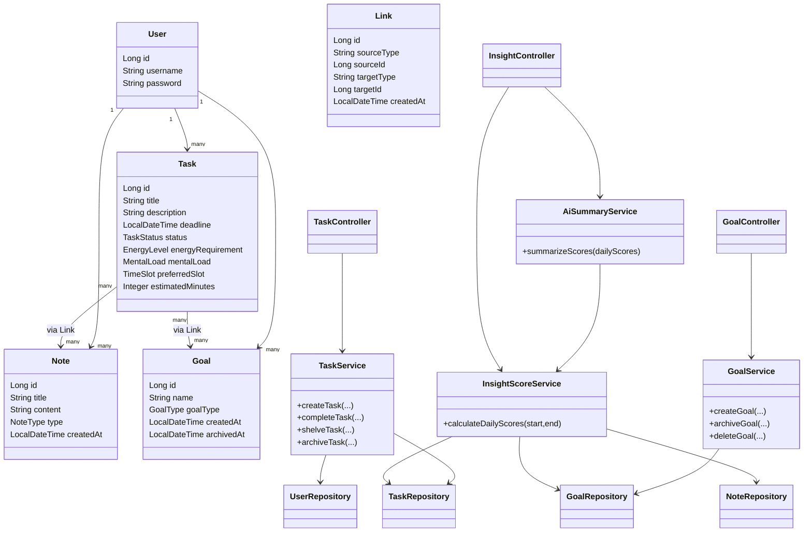
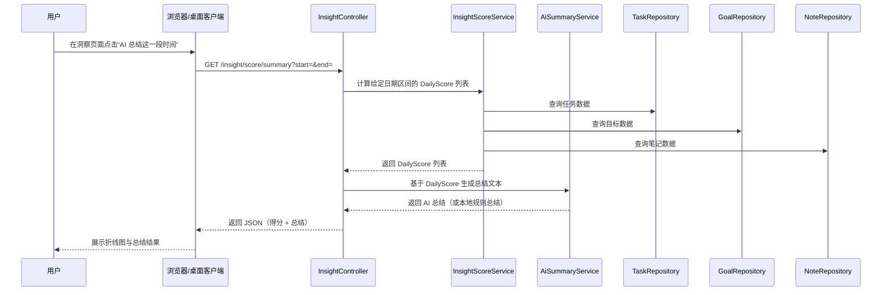
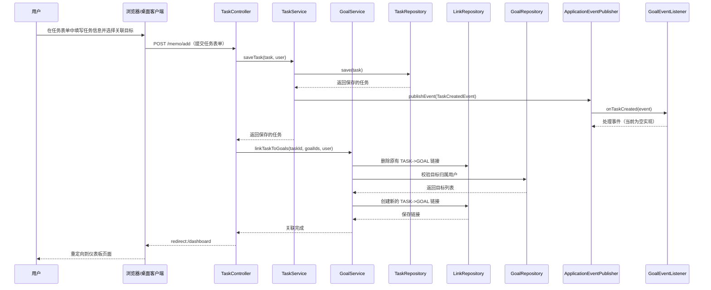
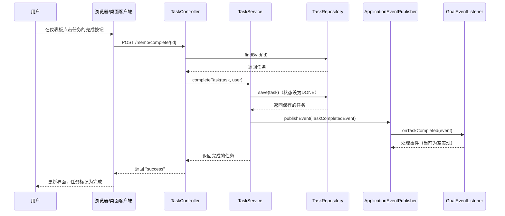
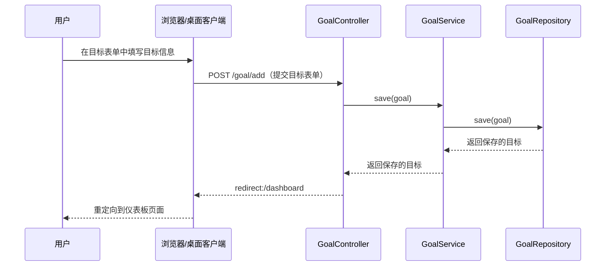
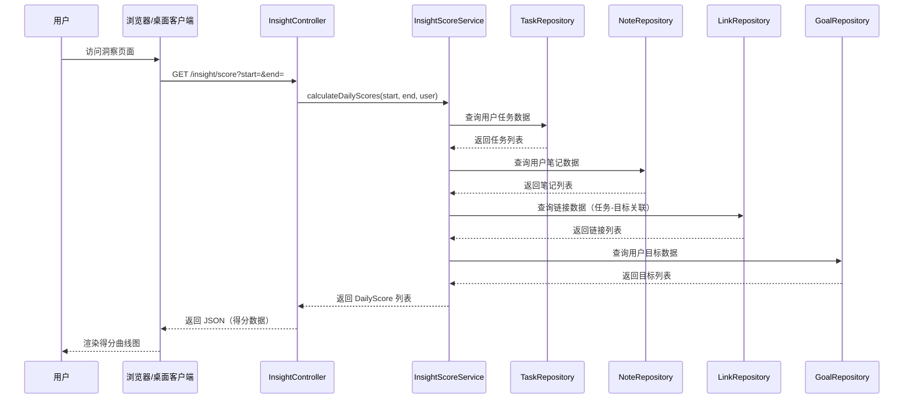

## Lattice-Planner 综合说明文档

**软件名称**：Lattice-Planner 
**当前版本**：V1.0.0

**源码地址**：https://github.com/zhzssp/Lattice-Planner.git

---

## 第 1 章 基本信息概述

### 1.1 编写目的

- 软件著作权登记时，作为「文档鉴别材料」与「软件简要说明」使用。  
- 项目研发、测试、运维与后续维护时的参考。  

### 1.2 软件简介

Lattice-Planner 是一款面向个人的规划与任务管理软件，由**服务端 Web 应用**与可选的 **Windows Electron桌面客户端**组成。用户通过浏览器或桌面客户端访问服务端，完成注册与登录后，可在不同思维模式（执行 / 学习 / 规划）下，对任务、目标、笔记进行管理，并查看规划得分曲线与 AI 总结。桌面客户端在用户登录状态下可常驻系统托盘，定期检查任务截止时间并发送桌面通知提醒。

### 1.3 软件基本信息

- **软件全称**：Lattice-Planner 
- **软件简称**：Lattice
- **版本号**：V1.0.0  
- **开发完成日期**：【 2026-2-27 】  
- **首次发表日期**：【 未发表 】  
- **著作权人**：【 郑皓 】  

### 1.4 术语与简称

| 术语/简称 | 含义                                   |
| ----- | ------------------------------------ |
| DDL   | 截止日期（Deadline）                       |
| 规划得分  | 按日统计的任务、目标、笔记三维度综合得分（0–100）          |
| 思维模式  | 执行（execute）、学习（learn）、规划（plan）三种使用模式 |
| 洞察    | 规划得分曲线与 AI 总结等统计与反馈功能                |
| 核心层   | 仅包含基础实体与服务的业务核心，不依赖插件                |
| 插件层   | 通过事件监听扩展核心功能的功能模块（如目标、洞察）            |

---

## 第 2 章 软件用途与面向领域

2.1 软件用途
--------

Lattice-Planner 是一款面向个人的规划与任务管理软件，用于帮助用户在「执行」「学习」「规划」等不同思维模式下，更有条理地安排与回顾工作与生活。**主要功能包括：**

1. **任务管理**：支持创建、完成、搁置与删除任务；可设置截止日期、精力需求、心理负担以及期望时间段；支持按关键词与日期范围进行搜索与筛选，并支持按时间段或精力分组的视图切换。

2. **目标管理**：支持创建与管理中长期目标，可将任务关联到目标；当任务状态发生变化时，通过事件驱动机制自动更新目标进度，并支持目标归档管理。

3. **笔记管理**：提供笔记添加、查看与分类管理功能，支持多种笔记类型，用于用户的日常记录、复盘总结与知识积累。

4. **用户偏好与思维模式**：支持用户自定义系统偏好，例如每屏任务数量、是否显示未来任务、是否显示统计信息等；用户可在不同思维模式间切换，在规划模式下可查看规划得分与 AI 总结。

5. **规划得分与统计分析**：系统基于任务、目标与笔记三个维度按日计算规划得分（0–100），并通过折线图形式展示一定时间范围内的得分变化趋势。

6. **AI 总结功能**：根据选定时间段内的规划得分数据自动生成自然语言总结与建议；当未配置外部模型时，系统将使用内置规则进行本地总结。

7. **AI 生成目标-任务树功能**：用户输入一个阶段性主题或目标后，系统可自动生成分层目标与可执行任务建议，形成可展开的目标-任务树草案；用户可在确认后将草案写入目标与任务模块，减少从想法到执行的规划成本。

8. **桌面端访问与提醒机制**：通过 Electron 桌面客户端访问 Web 服务，支持系统托盘常驻与单实例运行；在用户登录状态下定期检测任务截止时间，对即将到期或已过期任务发送桌面通知提醒。

2.2 面向领域 / 行业
-------------

Lattice-Planner 面向**个人效率管理与任务规划支持**场景，适用于以下典型人群：

1. **学习场景**：用于学习任务拆解、学习笔记记录与阶段复盘；
2. **工作场景**：用于工作任务安排、目标推进与周期回顾；
3. **生活场景**：用于生活计划管理与长期目标跟踪；
4. **知识复盘场景**：结合笔记、得分与 AI 总结进行阶段性反思。

总体上，本软件属于面向个人用户的通用型规划与任务管理软件。

* * *

## 第 3 章 系统总体设计

### 3.1 系统组成

Lattice-Planner 由三部分构成：

1. **服务端**：基于 Spring Boot，提供认证、任务/目标/笔记管理、偏好设置、规划得分与 AI 能力接口；

2. **Web 前端**：内嵌页面与静态资源，通过模板渲染与 REST 接口完成看板与管理交互；

3. **桌面客户端**：基于 Electron，加载服务端地址并提供托盘常驻、单实例与 DDL 提醒。
   
   ### 3.2 总体架构原则
* **核心与插件解耦**：核心层仅包含用户、任务、笔记、链接等实体及任务基础服务，不依赖任何业务插件；扩展功能（目标、洞察）通过 Spring 事件监听实现，核心通过发布事件与插件交互。
* **前后端一体部署**：Web 前端与后端同工程部署，减少跨域与部署复杂度；桌面端通过同一后端地址访问，会话通过 Cookie 保持。
* **可扩展性与维护性**：通过事件驱动与插件机制，支持在不修改核心代码的前提下添加新功能模块。

### 3.3 技术选型概览

| 层次    | 技术                                           |
| ----- |:--------------------------------------------:|
| 服务端框架 | Spring Boot、Spring MVC、Spring Security       |
| 数据访问  | JPA/Hibernate、MyBatis（部分）                    |
| 数据库   | MySQL                                        |
| 前端    | HTML、CSS、JavaScript，服务端模板渲染                  |
| 桌面端   | Electron、Node.js、Axios                       |
| 可选 AI | DeepSeek API，本地规则兜底 |

---

## 第 4 章 环境说明

### 4.1 服务端运行环境

- **操作系统**：Windows / Linux / macOS 等支持 JDK 的平台。  
- **Java 运行环境**：JDK 21。  
- **数据库**：MySQL 8.x；需预先创建数据库（如 `memo_db`），并在应用配置中填写连接地址、用户名、密码及时区等参数。  
- **可选依赖**：若需使用 AI 总结的在线模型，需配置 DeepSeek API Key（配置文件或环境变量）；否则，软件使用默认的统计分析总结。  

### 4.2 Web 端运行环境

- **浏览器**：Chrome、Edge、Firefox、Safari 等支持 HTML5 与 JavaScript 的现代浏览器。  
- **网络**：能够访问 Lattice-Planner 服务端部署地址（如 `http://localhost:8080` 或生产环境域名）。  

### 4.3 桌面端运行环境

- **操作系统**：Windows 10/11（当前提供 Windows x64 构建）。  
- **运行方式**：通过 Electron 打包的安装包或绿色包运行，无需单独安装 JDK。  
- **依赖**：需先启动 Lattice-Planner 服务端，桌面端通过配置的 `BASE_URL`（默认 `http://localhost:8080`）访问；可通过环境变量 `ELECTRON_APP_BASE_URL` 修改。  

### 4.4 开发环境与工具

- 操作系统：Windows 11 64 位 PC（x86_64）。  
- 开发工具：IntelliJ IDEA / VS Code 等。  
- 编程语言：Java、HTML/CSS/JavaScript。  
- 构建与依赖管理：Gradle、Spring Boot。  
- 数据库：MySQL（本地或远程实例，需要在application.properties手动配置地址）。  
- 版本管理：Git。  

### 4.5 环境配置与启动步骤

#### 4.5.1 前置条件

1. 安装 **JDK 21**，并确认 `java -version`；
2. 安装并启动 **MySQL 8.x**；
3. 准备可运行服务端并访问浏览器的设备。

#### 4.5.2 创建数据库

```sql
CREATE DATABASE memo_db
  DEFAULT CHARACTER SET utf8mb4
  DEFAULT COLLATE utf8mb4_unicode_ci;
```

#### 4.5.3 配置应用参数

编辑 `src/main/resources/application.properties`：

```properties
spring.datasource.url=jdbc:mysql://localhost:3306/memo_db?useSSL=false&serverTimezone=UTC&allowPublicKeyRetrieval=true
spring.datasource.username=root
spring.datasource.password=123456
# server.port=8080
```

可选：配置在线 AI 的 API Key，未配置时自动使用本地规则。

#### 4.5.4 构建与启动

在项目根目录执行：

```bash
# Windows
.\gradlew.bat clean bootJar
java -jar build/libs/【实际生成的JAR文件名】

# Linux / macOS
./gradlew clean bootJar
java -jar build/libs/【实际生成的JAR文件名】
```

启动后访问 `http://localhost:8080` 验证服务。

#### 4.5.5 最小启动验证

环境配置完成后，仅需进行最小可用性验证：

1. 启动服务端后，浏览器访问（默认）：

```text
http://localhost:8080
```

2. 若登录/注册页面可正常打开，且登录后可进入模式选择或主界面，可判定：
   
   - 服务端启动成功；
   - Web 端可访问；
   - 数据库连接基本正常。

3. 若访问失败，优先检查：
   
   - 服务端进程是否仍在运行；
   - `application.properties` 中数据库连接参数是否正确；
   - 本机端口或防火墙是否拦截访问。

> 说明：具体功能验证（任务、目标、笔记、洞察、AI、桌面提醒）统一见第 11 章“测试与验证”。

---

## 第 5 章 核心层与插件层架构概述

### 5.1 包结构概览

整体包结构遵循「核心层 + 插件层」的设计思路：

- **核心层（core）**：  
  
  - `entity`：User、Task、Note、Link 及与任务相关的枚举（TaskStatus、EnergyLevel、MentalLoad、TimeSlot、TaskGranularity、NoteType 等）。  
  - `core/event`：TaskCreatedEvent、TaskCompletedEvent、TaskArchivedEvent，在任务创建、完成、归档时由核心服务发布。  
  - `core/service`：TaskService，负责任务的创建、完成、搁置、归档及事件发布。  
  - `repository`：TaskRepository、UserRepository、NoteRepository、LinkRepository 等数据访问接口。  

- **插件层（feature）**：  
  
  - `feature/goal`：目标管理插件，负责中长期目标及其与任务的关联。  
  - `feature/insight`：洞察插件，负责规划得分计算与 AI 总结。  

核心原则：

- 插件依赖核心，核心不依赖插件。  
- 插件通过 `@EventListener` 监听核心事件扩展行为，而非直接修改核心代码。  
- 各插件之间独立，互不依赖。  

### 5.2 核心实体说明

- **User**：用户实体，主要属性包括 id、username（唯一）、password（加密后存储）。  
- **Task**：任务实体（表名兼容为 `memo`），主要属性包括：  
  - `title`、`description`、`deadline`（截止时间）、`status`（PENDING/DONE/SHELVED 等）、`granularity`、`energyRequirement`（精力需求）、`mentalLoad`（心理负担）、`preferredSlot`（期望时间段）、`estimatedMinutes`、`createdAt`、`shelvedAt`、`user` 等。  
  - 任务在规划得分统计中按 `deadline` 的日期归属到对应天。  
- **Note**：笔记实体，属性包括 id、title、content、type、createdAt、updatedAt、user 等。  
- **Link**：弱关联实体，用于表达多对多关系。属性包括 sourceType/sourceId、targetType/targetId、createdAt，用于表示任务与目标、任务与笔记等关联。  

### 5.3 事件驱动机制

核心服务在关键操作时发布领域事件，插件通过监听事件扩展行为而不修改核心代码：

- 任务创建：TaskService 保存任务后发布 `TaskCreatedEvent`。  
- 任务完成：TaskService 将任务状态置为 DONE 并保存后发布 `TaskCompletedEvent`。  
- 任务归档：TaskService 归档后发布 `TaskArchivedEvent`。  

事件对象携带任务实体及操作用户等信息，供 Goal、Insight 等插件使用。  

### 5.4 目标插件（feature/goal）

- **实体**：Goal，属性包括 id、name、goalType、createdAt、archivedAt、user 等。  
- **Repository**：GoalRepository。  
- **Service**：GoalService，负责目标的创建、归档、删除及与任务的关联维护。  
- **Controller**：GoalController，提供目标管理的 Web 接口。  
- **Listener**：GoalEventListener，监听任务相关事件，更新目标进度或做后续统计扩展。  

任务与目标的关联通过 Link 表或任务表中关联字段实现，目标进度由插件根据关联任务的完成情况计算。

### 5.5 洞察插件（feature/insight）

洞察插件提供**规划得分计算与 AI 总结**来帮助用户量化分析指定时间段的任务、目标完成情况，且不修改核心数据模型，仅读取任务、目标、笔记、链接等数据：

- **InsightScoreService**：  
  
  - 按日期区间计算每日规划得分，输入为当前用户、起始日、结束日；输出为 `DailyScore` 列表（字段包括 `date`、`totalScore`、`taskScore`、`goalScore`、`noteScore` 等）。  
  - 任务维度（约 0–70 分）：按任务截止日期归属，根据精力需求、心理负担、任务周期等计算权重，再结合完成情况与吞吐量因子得到得分。  
  - 目标维度（约 0–20 分）：根据目标整体进度、当日完成目标数、当日有推进的目标数等计算。  
  - 笔记维度（约 0–10 分）：根据当日笔记条数经递减增益函数映射。  
  - 得分按需计算，不持久化。  

- **AiSummaryService**：  
  
  - 对给定日期区间内的 `DailyScore` 列表生成自然语言总结。  
  - 采用「本地规则 + 外部 AI」双通路：优先使用配置的 DeepSeek API 生成总结；无 API Key 或调用超时/异常时，使用本地规则模板生成总结。  

- **InsightController**：  
  
  - 提供接口 `GET /insight/score?start=&end=` 返回指定日期区间内每日得分列表。  
  - 提供接口 `GET /insight/score/summary?start=&end=` 返回该区间的 AI 总结。  

### 5.6 AI 目标树生成插件（feature/ai-planning）

为支持「AI 生成目标-任务树」能力，系统在插件层扩展了 AI 规划能力模块（可命名为 `feature/ai-planning`），用于将用户输入的阶段主题自动转化为可执行的结构化目标与任务草案。该模块遵循“插件依赖核心、核心不依赖插件”的原则，不修改核心层实体与基础服务，仅通过服务编排与接口调用实现功能扩展。

- **AiGoalTreeService（建议命名）**：
  
  - 输入：当前用户、规划主题（如“2 个月完成 Java 后端项目”）、时间跨度、任务粒度偏好、每日可投入时长等。
  - 处理：调用外部模型（如 DeepSeek）或本地规则模板，将自然语言目标拆解为“目标节点 + 任务节点 + 依赖关系 + 建议截止日期”的树形结构。
  - 输出：`GoalTaskTreeDraft`（草案对象），字段可包含 `rootGoal`、`subGoals`、`tasks`、`priority`、`deadlineSuggestion`、`riskHints` 等。

- **AiGoalTreeController（建议命名）**：
  
  - 提供草案生成接口（如 `POST /api/ai/goal-task-tree/generate`），返回仅预览的树形结果；
  - 提供草案落库接口（如 `POST /api/ai/goal-task-tree/apply`），在用户确认后调用 GoalService / TaskService / LinkService 写入正式数据。

- **容错与兜底策略**：
  
  - 当外部模型 API Key 未配置、调用失败或超时，自动回退到本地规则模板生成“简化目标-任务树”；
  - 兜底结果仍保证基础可用（至少包含 1 个目标节点与若干可执行任务节点），以确保功能连续性。

- **与现有模块关系**：
  
  - 与 Goal 模块：生成并落地目标节点；
  - 与 Task 模块：生成并落地任务节点；
  - 与 Link 模块：建立任务与目标之间的关联关系；
  - 与 Insight 模块：后续可复用生成结果作为规划质量分析输入。

通过该插件，系统将“用户抽象想法”转化为“可执行任务结构”，增强了软件在规划阶段的智能辅助能力。

### 5.7 核心类与交互关系的 UML 图

本节给出核心类图与典型时序图，用于说明系统静态结构与关键调用链。

#### 5.7.1 核心类关系

类图覆盖实体、控制器、服务与仓储四类角色，重点体现：

- 用户与任务/目标/笔记的一对多关系；
- 任务与目标、任务与笔记通过 `Link` 的多对多关系；
- 控制器调用服务、服务调用仓储的分层依赖；
- 插件层服务通过事件机制与核心层解耦。


```mermaid
classDiagram
    class User {
        Long id
        String username
        String password
    }

    class Task {
        Long id
        String title
        String description
        LocalDateTime deadline
        TaskStatus status
        EnergyLevel energyRequirement
        MentalLoad mentalLoad
        TimeSlot preferredSlot
        Integer estimatedMinutes
    }

    class Note {
        Long id
        String title
        String content
        NoteType type
        LocalDateTime createdAt
    }

    class Goal {
        Long id
        String name
        GoalType goalType
        LocalDateTime createdAt
        LocalDateTime archivedAt
    }

    class Link {
        Long id
        String sourceType
        Long sourceId
        String targetType
        Long targetId
        LocalDateTime createdAt
    }

    class TaskService {
        +createTask(...)
        +completeTask(...)
        +shelveTask(...)
        +archiveTask(...)
    }

    class GoalService {
        +createGoal(...)
        +archiveGoal(...)
        +deleteGoal(...)
    }

    class InsightScoreService {
        +calculateDailyScores(start,end)
    }

    class AiSummaryService {
        +summarizeScores(dailyScores)
    }

    class TaskRepository
    class UserRepository
    class NoteRepository
    class GoalRepository

    class TaskController
    class GoalController
    class InsightController

    User "1" --> "many" Task
    User "1" --> "many" Note
    User "1" --> "many" Goal

    Task "many" --> "many" Goal : via Link
    Task "many" --> "many" Note : via Link

    TaskService --> TaskRepository
    TaskService --> UserRepository

    GoalService --> GoalRepository
    InsightScoreService --> TaskRepository
    InsightScoreService --> GoalRepository
    InsightScoreService --> NoteRepository
    AiSummaryService --> InsightScoreService

    TaskController --> TaskService
    GoalController --> GoalService
    InsightController --> InsightScoreService
    InsightController --> AiSummaryService
```

其中：

- 核心实体：`User`、`Task`、`Note`、`Goal`、`Link`；
- 核心服务：`TaskService`（创建/完成/搁置/归档 + 事件发布）；
- 插件服务：`GoalService`、`InsightScoreService`、`AiSummaryService`；
- Web 控制器：`TaskController`、`GoalController`、`InsightController`。

#### 5.7.2 典型交互流程（AI 总结时序图）

下图展示用户在洞察页面触发 AI 总结时的典型调用链：前端请求 → 控制器 → 得分计算 → AI 生成（失败时本地兜底）→ 返回结果。


```mermaid
sequenceDiagram
    participant U as 用户
    participant C as 浏览器/桌面客户端
    participant IC as InsightController
    participant IS as InsightScoreService
    participant AS as AiSummaryService
    participant TR as TaskRepository
    participant GR as GoalRepository
    participant NR as NoteRepository

    U->>C: 在洞察页面点击“AI 总结这一段时间”
    C->>IC: GET /insight/score/summary?start=&end=
    IC->>IS: 计算给定日期区间的 DailyScore 列表
    IS->>TR: 查询任务数据
    IS->>GR: 查询目标数据
    IS->>NR: 查询笔记数据
    IS-->>IC: 返回 DailyScore 列表
    IC->>AS: 基于 DailyScore 生成总结文本
    AS-->>IC: 返回 AI 总结（或本地规则总结）
    IC-->>C: 返回 JSON（得分 + 总结）
    C-->>U: 展示折线图与总结结果
```

#### 5.7.3 任务创建与关联目标时序图

下图展示创建任务并关联目标的主流程：任务保存、事件发布、目标关联与页面回跳。


```mermaid
sequenceDiagram
    participant U as 用户
    participant C as 浏览器/桌面客户端
    participant TC as TaskController
    participant TS as TaskService
    participant GS as GoalService
    participant TR as TaskRepository
    participant LR as LinkRepository
    participant GR as GoalRepository
    participant EP as ApplicationEventPublisher
    participant GEL as GoalEventListener

    U->>C: 在任务表单中填写任务信息并选择关联目标
    C->>TC: POST /memo/add（提交任务表单）
    TC->>TS: saveTask(task, user)
    TS->>TR: save(task)
    TR-->>TS: 返回保存的任务
    TS->>EP: publishEvent(TaskCreatedEvent)
    EP->>GEL: onTaskCreated(event)
    GEL-->>EP: 处理事件（当前为空实现）
    TS-->>TC: 返回保存的任务
    TC->>GS: linkTaskToGoals(taskId, goalIds, user)
    GS->>LR: 删除原有 TASK->GOAL 链接
    GS->>GR: 校验目标归属用户
    GR-->>GS: 返回目标列表
    GS->>LR: 创建新的 TASK->GOAL 链接
    LR-->>GS: 保存链接
    GS-->>TC: 关联完成
    TC-->>C: redirect:/dashboard
    C-->>U: 重定向到仪表板页面
```

#### 5.7.4 任务完成时序图

下图展示任务完成请求的关键路径：校验归属、更新状态、发布完成事件、前端刷新显示。


```mermaid
sequenceDiagram
    participant U as 用户
    participant C as 浏览器/桌面客户端
    participant TC as TaskController
    participant TS as TaskService
    participant TR as TaskRepository
    participant EP as ApplicationEventPublisher
    participant GEL as GoalEventListener

    U->>C: 在仪表板点击任务的完成按钮
    C->>TC: POST /memo/complete/{id}
    TC->>TR: findById(id)
    TR-->>TC: 返回任务
    TC->>TS: completeTask(task, user)
    TS->>TR: save(task)（状态设为DONE）
    TR-->>TS: 返回保存的任务
    TS->>EP: publishEvent(TaskCompletedEvent)
    EP->>GEL: onTaskCompleted(event)
    GEL-->>EP: 处理事件（当前为空实现）
    TS-->>TC: 返回完成的任务
    TC-->>C: 返回 "success"
    C-->>U: 更新界面，任务标记为完成
```

#### 5.7.5 目标创建时序图

下图展示目标创建的标准流程：前端提交、控制器路由、服务保存、回跳看板。


```mermaid
sequenceDiagram
    participant U as 用户
    participant C as 浏览器/桌面客户端
    participant GC as GoalController
    participant GS as GoalService
    participant GR as GoalRepository

    U->>C: 在目标表单中填写目标信息
    C->>GC: POST /goal/add（提交目标表单）
    GC->>GS: save(goal)
    GS->>GR: save(goal)
    GR-->>GS: 返回保存的目标
    GS-->>GC: 返回保存的目标
    GC-->>C: redirect:/dashboard
    C-->>U: 重定向到仪表板页面
```

#### 5.7.6 规划得分计算时序图

下图展示洞察得分计算流程：按区间拉取任务/目标/笔记/关联数据，聚合后返回每日得分。


```mermaid
sequenceDiagram
    participant U as 用户
    participant C as 浏览器/桌面客户端
    participant IC as InsightController
    participant ISS as InsightScoreService
    participant TR as TaskRepository
    participant NR as NoteRepository
    participant LR as LinkRepository
    participant GR as GoalRepository

    U->>C: 访问洞察页面
    C->>IC: GET /insight/score?start=&end=
    IC->>ISS: calculateDailyScores(start, end, user)
    ISS->>TR: 查询用户任务数据
    TR-->>ISS: 返回任务列表
    ISS->>NR: 查询用户笔记数据
    NR-->>ISS: 返回笔记列表
    ISS->>LR: 查询链接数据（任务-目标关联）
    LR-->>ISS: 返回链接列表
    ISS->>GR: 查询用户目标数据
    GR-->>ISS: 返回目标列表
    ISS-->>IC: 返回 DailyScore 列表
    IC-->>C: 返回 JSON（得分数据）
    C-->>U: 渲染得分曲线图
```

通过上述 UML 类图与时序图，可以直观体现本软件中**核心类之间的结构关系与典型交互过程**。

---

## 第 6 章 规划得分设计说明

**本章在5.5节的基础上**，对「规划得分」的设计思想与实现算法进行了**展开说明**，以便从**算法复杂度、数据来源与权重设计**等角度刻画本软件的核心创新点。

### 6.1 规划得分设计目标

规划得分并非单纯的「完成任务数量统计」，而是试图从以下三个维度衡量用户每天的规划质量：

1. **任务执行质量（Task Score）**
   
   * 不鼓励仅完成大量琐碎任务。
   * 鼓励完成少量但与长期目标强相关、精力需求较高的关键任务。
   * 兼顾任务数量与任务权重，体现「结构化努力」。

2. **目标推进质量（Goal Score）**
   
   * 鼓励用户围绕少数核心目标持续推进，而非每天在大量目标之间跳跃。
   * 对「有持续推进痕迹的目标」给予额外加分，体现聚焦度。

3. **认知与复盘质量（Note Score）**
   
   * 鼓励用户在每天结束时进行简要复盘或记录。
   * 使用递减增益函数，避免用户通过机械地多写空笔记刷分。

最终的**总得分Total Score**为三者加权求和，范围为 0–100 分：

$TotalScore_d = TaskScore_d + GoalScore_d + NoteScore_d$

其中下标 $d$ 表示某一自然日。

### 6.2 任务维度得分计算

#### 6.2.1 任务权重模型

每一条任务在某一天的得分计算中都会先映射为一个**基础权重** $w_t$，主要由以下因素构成：

* 精力需求（Energy Level）
  * 高精力任务通常更难执行，给予更高的基础系数。
* 心理负担（Mental Load）
  * 心理负担较重的任务在被完成时代表较大的心理突破，给予额外加权。
* 粒度/周期（Granularity 或类似字段）
  * 长周期、抽象度较高的任务，若被拆分并完成其子任务，可通过父级目标体现；
  * 短周期具体任务本身得分不设额外放大，以防过度碎片化。

示例权重设计如下（实际实现中通过枚举映射实现）：

1. 精力需求映射：
   
   * 低精力：\(e = 1.0\)
   * 中精力：\(e = 1.2\)
   * 高精力：\(e = 1.5\)

2. 心理负担映射：
   
   * 轻：\(m = 1.0\)
   * 中：\(m = 1.1\)
   * 重：\(m = 1.3\)

3. 基础权重：$w_t = e \times m$

在实现中，`Task` 实体中保存精力与心理负担等枚举字段，`InsightScoreService` 在加载任务记录后通过 switch 或映射表计算对应权重。

### 6.2.2 任务完成度与吞吐量因子

对于给定日期 $d$，系统会筛选出所有「截止日期为 $d$」的任务集合 $T_d$，并将它们划分为：

* 当天已完成集合 $T_d^{done}$
* 当天未完成或搁置集合 $T_d^{pending}$

在计算时：

1. 仅对 $T_d^{done}$ 中的任务累加权重：

$$
RawTaskScore_d = \sum_{t \in T_d^{done}} w_t
$$

2. 为避免无限刷分，对每日任务加一个 **吞吐量因子**：
* 设当天完成任务条数为：

$$
n_d = |T_d^{done}|
$$

* 使用一个递减增益函数 $f(n_d)$ 映射到 $0 \sim 1$：

$$
f(n_d) = 1 - e^{-k \cdot n_d}
$$

其中 $k$ 为常数（例如 $0.3$），体现「少量任务也有较大收益，更多任务收益递减」的逻辑。

3. 将原始得分映射到 $0\text{–}70$ 区间：
* 首先设定一个经验上的「合理上限」 $S_{max}$，例如按每天 $6$ 个高精力、高心理负担任务估算：

$$
S_{max} \approx 6 \times (1.5 \times 1.3) \approx 11.7
$$

* 计算：

$$
NormTaskScore_d =
\min\left(1, \frac{RawTaskScore_d}{S_{max}}\right)
\times 70 \times f(n_d)
$$

在实际实现中，`InsightScoreService` 将上述逻辑离散化为若干步：

* 遍历任务集合累加权重；
* 根据任务数选择预设的分段函数（减少浮点复杂公式）；
* 使用 `clamp` 限制得分不超过 70。

### 6.3 目标维度得分计算

目标维度关注的是「是否在持续推进核心目标」，因此采用如下三部分构成：

1. **目标覆盖面（Coverage）**
   
   * 设当天有推进（至少完成 1 条关联任务）的目标集合为 $G_d^{active}$。
   * 用活跃目标数量与总活跃目标（最近一段时间内有活动的目标）数量之比，衡量当天是否只盲目集中在少数目标还是有适度分散。

2. **当天达成目标数（Completed Goals）**
   
   * 当天归档的目标数越多，给予额外加分，用于奖励「阶段性冲刺」。

3. **长期一致性（Streak）**（可选，当前实现中为简化版）
   
   * 统计最近若干天中连续有推进记录的目标数量或天数，作为长期激励。

在实现中，目标维度得分简化为：

$GoalScore_d = \min(20, \alpha \cdot |G_d^{active}| + \beta \cdot CompletedGoals_d)$

其中 $\alpha$ 与 $\beta$ 为经验参数，例如：

* 若当天有 1～2 个目标被推进，则能拿到 8～12 分；
* 若额外有 1 个目标在当天被归档，可再获得 5～8 分；
* 整体上限控制在 20 分以内。

核心数据由 `GoalRepository` 与 `LinkRepository` 查询获得：

* 先根据日期范围与用户 ID 拉取关联任务的完成记录；
* 再通过 Link 查询这些任务对应的目标集合，统计活跃目标与归档目标。

### 6.4 笔记维度得分计算

笔记维度使用一个简单的递减增益函数：

1. 设当天新建的笔记数为 $n_d^{note}$。
2. 设计函数：

$NoteScore_d = 10 \times (1 - e^{-c \cdot n_d^{note}})$

其中常量 \(c\) 控制增长速度（例如 0.7）。

* 当 $n_d^{note} = 1$ 时，可获得约 5～6 分；
* 当 $n_d^{note} = 3$ 时，得分接近满分 9～10 分；
* 继续增加笔记数量，得分提升极小，避免刷分。

在实现上，`InsightScoreService` 中会对指定日期范围内的 `Note` 实体按日期分组计数，然后使用一个离散化后的分段函数来近似上述公式，例如：

* 0 条：0 分
* 1 条：5 分
* 2 条：8 分
* ≥3 条：10 分

### 6.5 计算流程与数据访问

对一个给定的日期区间 \([start, end]\)，`InsightScoreService` 的总体计算流程如下：

1. 根据用户 ID、起止日期，从 `TaskRepository`、`GoalRepository`、`NoteRepository` 中一次性拉取对应时间段的数据。
2. 构建一个以日期为 key 的 Map（如 `Map<LocalDate, DailyScoreAccumulator>`）。
3. 遍历任务列表：
   * 以任务的 `deadline` 日期为索引，更新对应日期的任务权重累积与完成度信息。
4. 遍历目标与链接：
   * 统计每天有推进任务的目标集合；
   * 统计每天归档目标数。
5. 遍历笔记列表：
   * 按 `createdAt` 日期分组计数。
6. 对每个日期 $d$ 使用 9.2～9.4 节的算法求得 TaskScore、GoalScore 与 NoteScore，并相加得到 `totalScore`。
7. 构造 `DailyScore` 对象列表，按日期排序返回。

整个算法对「数据条目数量」是线性复杂度 $O(N)$，其中 $N$ 为指定区间内的任务 + 笔记 + 目标/链接总数，适用于个人效率工具的典型数据规模。

---

## 第 7 章 模块详细设计与实现说明

本章从「任务模块」「目标模块」「笔记模块」「偏好与模式模块」四个方面，对主要业务功能模块进行**更细致**的类设计与实现说明。

### 7.1 任务模块（Task Module）

#### 7.1.1 任务实体字段设计

任务实体 `Task`（数据库兼容表名 `memo`）的主要字段说明如下：

* `id`：主键，自增或由 JPA 管理。
* `user`：关联的用户实体，确保任务属于某一用户。
* `title`：任务标题，支持简短自然语言描述。
* `description`：任务详细描述，可为空。
* `deadline`：截止时间，使用 `LocalDateTime` 存储，日期部分用于规划得分归属。
* `status`：任务状态枚举，典型值包括：
  * `PENDING`：未完成；
  * `DONE`：已完成；
  * `SHELVED`：已搁置；
  * 其他中间状态按需求扩展。
* `energyRequirement`：精力需求枚举，对应 9.2 节中的权重因素。
* `mentalLoad`：心理负担枚举。
* `preferredSlot`：期望时间段枚举，如 `MORNING`、`AFTERNOON`、`EVENING`。
* `estimatedMinutes`：预估所需时间，整数分钟数。
* `createdAt`/`updatedAt`：创建与更新时间戳。
* `shelvedAt`：搁置时间戳，用于统计用户「逃避」任务的情况（当前版本中不直接计分）。

这些字段通过 JPA 注解映射到 MySQL 表的列，支持按用户与状态进行组合查询。

#### 7.1.2 任务服务类（TaskService）实现思路

`TaskService` 负责封装所有与任务相关的业务逻辑，主要方法包括：

* `createTask`：
  
  * 校验用户是否存在；
  * 构造 `Task` 实体并设置默认状态与时间戳；
  * 调用 `TaskRepository.save` 持久化；
  * 发布 `TaskCreatedEvent` 事件供插件监听。

* `completeTask`：
  
  * 根据 ID 查询任务并校验所属用户；
  * 更新状态为 `DONE`，记录完成时间（如使用 `updatedAt`）；
  * 保存后发布 `TaskCompletedEvent`。

* `shelveTask`：
  
  * 将状态置为 `SHELVED`，记录 `shelvedAt`；
  * 保存后发布 `TaskArchivedEvent` 或专门的搁置事件。

* `deleteTask`：
  
  * 调用仓储删除记录；
  * 可按需发布删除事件，以便插件清理关联数据。

在实现过程中，所有对外暴露的方法都保证「用户权限校验在前」，以防止跨用户操作任务。

#### 7.1.3 任务控制器与视图交互

`TaskController` 负责将 HTTP 请求映射为任务服务调用，典型交互流程包括：

1. 列表视图：
   
   * `GET /dashboard` 或 `/memo/list`：
     * 从 `TaskService` 根据当前登录用户查询当天任务列表；
     * 根据用户偏好决定是否同时展示未来任务；
     * 将结果以视图模型的形式传递给模板引擎渲染。

2. 新建/编辑视图：
   
   * `GET /memo/new`：返回包含空表单的页面。
   * `POST /memo`：接收表单数据，构造 DTO，并调用 `TaskService.createTask`。

3. 状态变更：
   
   * `POST /memo/{id}/complete`：调用 `TaskService.completeTask`；
   * `POST /memo/{id}/shelve`：调用 `TaskService.shelveTask`；
   * `POST /memo/{id}/delete`：删除任务。

前端在实现上采用传统的表单与按钮交互方式，便于在无 JavaScript 的场景下也基本可用；在支持 JavaScript 的环境中，可通过少量脚本增强用户体验（如局部刷新）。

### 7.2 目标模块（Goal Module）

目标模块建立在任务模块之上，通过多对多关联实现「多个任务支持一个目标，多个目标包含一个任务」的灵活关系。

#### 7.2.1 目标实体与类型

`Goal` 实体的关键字段包括：

* `id`：主键。
* `user`：所属用户。
* `name`：目标名称，如「完成 XX 课程」「重构 YY 模块」。
* `goalType`：目标类型，如「学习」「工作」「生活」等，用于在界面上分组。
* `createdAt`/`archivedAt`：创建与归档时间。

在实现上，`GoalType` 是一个枚举，便于在界面上做图标或颜色上的区分。

#### 7.2.2 任务与目标的关联方式

任务与目标之间的关联通过 `Link` 表实现：

* `sourceType`：通常为 `"TASK"`。
* `sourceId`：任务 ID。
* `targetType`：通常为 `"GOAL"`。
* `targetId`：目标 ID。

这样设计的好处是：

* 未来若需要为任务与笔记之间建立关联，也可通过同一张 `Link` 表实现；
* 不需要在任务表或目标表中增加多余的外键列，保持核心实体简洁。

在代码中，`GoalService` 会提供类似 `linkTaskToGoal(taskId, goalId)` 的方法，用于在创建或编辑任务时建立关联。

#### 7.2.3 目标进度与树状视图

目标进度的计算思路为：

1. 根据目标 ID 查询所有与之关联的任务集合。
2. 统计这些任务中状态为 `DONE` 的数量与总数量。
3. 以百分比形式表示目标完成度，如 \(progress = \frac{done}{total}\)。

在「目标-任务树视图」中：

* 顶层节点为目标（可包含子目标，若实现了层级目标）；
* 子节点为与之关联的任务；
* 每个节点展示名称、状态与简单进度信息（如「3/7」）。

前端通过从 `/api/goal-task-tree` 接口获取一个树形 JSON 结构，递归渲染出树状列表，用户可展开/收起节点。

### 7.3 笔记模块（Note Module）

笔记模块相对简单，主要承担「记录」「回顾」「为得分提供复盘依据」的职责。

#### 7.3.1 笔记类型与结构

`Note` 实体包含：

* `id`、`user`：主键与所属用户。
* `title`：笔记标题。
* `content`：正文内容，支持 Markdown 等简单标记语法。
* `type`：笔记类型枚举，例如：
  * `REFLECTION`（复盘）；
  * `LEARNING`（学习记录）；
  * `IDEA`（灵感）；
  * `OTHER`。
* `createdAt`/`updatedAt`：时间戳。

笔记类型在当前版本的得分计算中不做差异化处理，但可以在界面上采用不同颜色或标签呈现。

#### 7.3.2 笔记列表与详情视图

`NoteController` 提供：

* `GET /notes`：按创建时间倒序展示当前用户的所有笔记列表。
* `GET /notes/{id}`：展示单条笔记详情。
* `GET /notes/new` + `POST /notes`：新建笔记流程。

在「洞察」页面中，系统不会直接展示笔记全文，而是只统计数量用以得分计算。用户可以通过点击某一天的得分点跳转到对应日期的笔记列表（若前端实现了该增强功能）。

### 7.4 偏好与思维模式模块

#### 7.4.1 用户偏好存储结构

用户偏好通常以以下两种方式之一实现：

1. 单独的 `user_preference` 表，包含：
   
   * `user_id`
   * `defaultMode`（默认思维模式）
   * 每个模式下的每屏任务数、是否显示统计等字段。

2. 或以 JSON 字符串形式存储在用户表的某个扩展字段中。

本系统中采用了显式字段 + 适度 JSON 扩展的折中方式，既便于查询，又支持后续扩展。

#### 7.4.2 模式切换实现

在控制器层，用户通过某个路径（如 `/mode/switch?mode=PLAN`）发起模式切换请求：

1. 控制器读取当前登录用户与请求中的目标模式枚举。
2. 调用 `PreferenceService` 更新用户的默认模式或当前会话模式。
3. 更新完成后重定向回主界面，前端根据模式决定展示哪些组件：
   * 执行模式：突出今日任务列表；
   * 学习模式：突出学习任务与对应笔记；
   * 规划模式：突出目标、洞察与得分曲线。

---

## 第 8 章 桌面客户端设计说明

本章详细说明 Electron 桌面客户端的实现原理，包括窗口管理、托盘图标、定时器与通知机制等。

### 8.1 总体结构

桌面客户端采用典型的 Electron 应用结构：

* **主进程（Main Process）**：
  
  * 负责创建浏览器窗口（`BrowserWindow`）；
  * 管理系统托盘图标与右键菜单；
  * 维护单实例锁，防止重复启动；
  * 定时调用服务端接口进行 DDL 检查。

* **渲染进程（Renderer Process）**：
  
  * 实际加载服务端提供的 Web 页面（如 `http://localhost:8080`）；
  * 用户在该页面内完成登录与日常操作。

### 8.2 单实例与托盘管理

#### 8.2.1 单实例锁

在 Electron 主进程中，应用启动时会调用：

* `app.requestSingleInstanceLock()`：尝试获取单实例锁。
* 若获取失败（表示已有实例运行），则当前进程立即退出；
* 若获取成功，则监听 `second-instance` 事件，在用户再次启动时将已有窗口激活到前台。

这种设计保证了：

* 用户不会因为多次双击而启动多个客户端窗口；
* DDL 定时任务只在一个进程中运行，避免重复提醒。

#### 8.2.2 托盘图标与窗口隐藏

主进程在应用就绪后：

1. 创建主窗口 `BrowserWindow`，设置合适的宽高与图标。
2. 创建系统托盘图标 `Tray`，并为其绑定右键菜单：
   * 「打开主窗口」
   * 「退出」
3. 拦截窗口的 `close` 事件：
   * 在用户点击窗口关闭按钮时，不真正退出应用，而是将窗口隐藏到托盘；
   * 只有在用户从托盘菜单选择「退出」时才真正调用 `app.quit()`。

这样可以实现「最小化到托盘」的常见桌面端行为，便于长期运行。

### 8.3 DDL 检查与桌面通知

#### 8.3.1 心跳与登录状态检查

客户端需要确保只有在用户已登录的情况下才进行任务截止时间检查，因此主进程维护一个定时器，定期执行以下步骤：

1. 向服务端发起 `GET /user-logged-in` 请求：
   
   * 若返回表示用户未登录或会话失效，则跳过后续检查；
   * 若返回已登录状态，则进入 DDL 检查流程。

2. 该请求通常不需要复杂参数，只依赖 Cookie（`JSESSIONID`）即可定位用户。

#### 8.3.2 截止日期接口与过滤逻辑

当确认用户登录后，主进程调用 `GET /due-dates` 接口，服务端返回类似如下结构的 JSON：

* 已过期任务列表；
* 1 天内截止的任务列表；
* 3 天内截止的任务列表。

客户端在接收到列表后，会对每一条任务进行本地过滤，保证：

* 同一任务在同一天内只提醒一次（通过在本地内存中记录「任务 ID + 日期」集合实现）；
* 对不同类别（已过期/即将到期）可采用不同提示文案。

#### 8.3.3 桌面通知展示

符合提醒条件的任务将通过 Electron 的 `new Notification()` 接口显示桌面通知：

* 标题中包含「Lattice-Planner 提醒」和紧急程度；
* 内容中包含任务标题与截止日期；
* 通知点击事件可选择将主窗口激活并跳转到对应任务页面。

在实现中，为了兼容 Windows 的通知中心，通知创建需遵循操作系统的相关要求，如使用应用图标等。

---

## 第 9 章 功能与用户使用流程说明

### 9.1 登录&思维模式

- 用户可通过浏览器访问服务端 URL（如 `http://localhost:8080`），或通过桌面客户端打开同一地址，从而进入注册/登录界面。  
  
  * 登录界面如下。输入注册过的用户名和密码并点击【Login】即可登录，输入的密码始终不会直接显示出来。
  
  
  
  * 注册界面如下。输入自己想要设置的用户名和密码，然后点击【Register】即可注册成功。
    

- 刚登录时，系统会**引导选择**思维模式：  
  
  - **执行模式**：信息密度低，偏向简单管理待办任务，界面中只会显示今日未完成任务。  
  - **学习模式**：信息密度适中，强调学习过程与积累，主要新增笔记管理功能。  
  - **规划模式**：信息密度大，专注于长期计划的规划与复盘，提供筛选、视图、规划得分与 AI 总结等一系列复杂的功能。  
  
  
* **各个思维模式的界面如下所示：**
  
  * **执行模式**：界面之中只展示今日任务，可以添加任务或者执行右上角几个固定按键的操作（**具体细节后面补充说明**）
    
  
  * **学习模式**：整体上与执行模式相差不算太大，主要是在界面右侧添加了创建笔记的功能。
    
  
  * **规划模式**：因为界面较大，完整页面分为多张图进行展示。其中包含最为复杂的功能，包括：
    
    * 用于快速定位板块的侧边栏
    
    * 任务完成度相关的统计信息
    
    * 各种任务视图（今日视图、时间段视图、精力视图，搁置/归档任务）
    
    
    
    
    

### 9.2 任务管理

> 在所有的思维模式之中都可以进行任务管理，并且使用方式完全一致，因此在这里统一进行说明！

#### 9.2.1 创建任务

用户可在**任意思维模式处**点击「添加任务」按键进入任务表单，对应的【今日可行动任务】也可以在任意一种模式之中看到。


创建任务时需要填写以下信息（部分内容要求**必填**）：

- 标题与描述

- 截止日期（Deadline）

- 精力需求（Energy Level）

- 心理负担（Mental Load）

- 期望时间段（Preferred Slot）

- 关联目标（可选，仅规划模式支持）
  

> 添加任务页面详细操作指引

- **任务标题输入框**：输入任务标题（必填，简短描述任务内容）。
- **描述文本框**：输入任务详细描述（可选，用于补充说明）。
- **截止时间选择器**：选择任务截止日期和时间（必填，格式为日期时间选择器）。
- **任务粒度选择**：选择原子任务（最小可执行单元）、标准任务或模糊任务（影响得分计算）。
- **预估时长输入框**：输入预计完成时间（分钟，可选，用于时间规划）。
- **精力需求选择**：选择高、中、低精力或不指定（影响任务权重）。
- **心理负担选择**：选择心理负担重或轻（影响任务权重）。
- **偏好时间段选择**：选择上午、下午、晚上或不指定（用于视图分组）。
- **绑定目标复选框**（如果有目标）：选择关联的目标，可多选（仅规划模式显示）。**值得注意的是**，只有在创建了目标之后，才可以在添加任务的界面中看到可绑定的目标！
- **添加按钮**：提交表单创建任务并返回仪表板。

#### 9.2.2 管理任务

在**任意思维模式**的看板或任务列表中，用户可以：

- 标记任务为完成（Done）  

- 搁置任务（Shelve）

- 删除任务

- 搜索 / 筛选任务 

- 切换视图
  
  
  

> 任务右键菜单操作

用户在任务列表中右键点击任务项，会弹出上下文菜单：

- **完成按钮**：标记任务为已完成，更新状态为DONE，刷新页面显示。
- **搁置按钮**：将任务标记为搁置（SHELVED），从当前视图隐藏。
- **删除按钮**：永久删除任务，弹出确认对话框。
- **取消按钮**：关闭右键菜单，不执行任何操作。

删除后该任务条目永久消失，完成/搁置的结果**均只能**在【规划模式】之中才可以看到。其中【Done】代表已完成，而【Shelved】代表搁置。


### 9.3 目标与笔记管理

#### 9.3.1 目标管理

在「目标」页面，用户可以：

- 创建目标 
- 归档目标
- 删除目标

> 创建目标只能在规划模式：


> 目标条目的右侧可以执行【归档】或者【删除】的操作：


> 创建目标操作

* **目标名称输入框**：输入目标名称（必填）。

* **目标类型选择**：选择长期、中期、短期或不指定。

* **保存按钮**：保存目标并关闭模态框。

* **取消按钮**：关闭模态框不保存。
  

#### 9.3.2 目标-任务树

系统还提供**目标-任务树视图**（Goal-Task Tree）（**在所有思维模式的右上角均有此按键**）：

- 以树状结构展示用户的根目标、子目标及其下关联的任务节点
  

- 可以通过右上角按键控制功能的开关
  
  
  

#### 9.3.3 笔记管理

在「笔记」页面（**仅学习模式支持**），用户可以：

- 添加笔记 
- 查看笔记


> 创建笔记操作

点击"创建笔记"按钮打开模态框：

* **笔记类型切换按钮**：
  * 临时想法：快速记录想法。
  * 学习笔记：记录概念、定义、示例。
  * 项目笔记：记录决策、TODO、问题。
  * 复盘笔记：记录成功/失败、原因、教训。
* **标题输入框**（可选）：输入笔记标题。
* **内容输入框**：根据类型显示不同的输入字段。
* **保存按钮**：保存笔记并关闭模态框。
* **取消按钮**：关闭模态框不保存。
  
  

> 查看笔记

笔记在学习模式右侧列表中显示，格式为"[类型] 标题"。


> 笔记有四种模板可供选择，分别对应不同的场景：


### 9.4 用户偏好与界面设置

用户可在「偏好设置 / 用户设置」页面调整个人使用偏好。

> 除了一部分通用偏好设置之外，每一个思维模式都有不同的偏好设置可以调整。

- **通用设置**：界面主题（亮/暗）、默认思维模式等。  

- **按模式设置**：  
  
  - 每屏最多显示任务数。  
  
  - 是否显示未来任务。  
  
  - 是否显示统计信息（决定规划模式下是否展示得分与 AI 总结入口）。  
  
  - 默认任务视图（今日/时间段/精力）。  
  
  - 是否显示目标区块、归档区块、模糊任务提示等。  \
    
    * **执行模式**
    
    
    
    * **学习模式**
    
    
    
    * **规划模式**
    
    
    
    
    

> 偏好设置页面详细操作指引

- **恢复默认设置按钮**：重置所有偏好为默认值。

- **通用设置**：
  
  - 背景亮/暗选择：切换界面主题。
    
  
  - 默认思维模式选择：设置登录后的默认模式。

- **模式特定设置**（选择标签切换）：
  
  - 每屏最多显示任务数：限制任务列表长度。
  - 显示未来任务复选框（学习/规划模式）：是否显示截止日期在未来的任务。
  - 默认任务视图选择（规划模式）：设置进入规划模式时的默认视图。
  - 显示统计信息复选框（规划模式）：是否显示完成率等统计。
  - 显示目标管理区块复选框（规划模式）：是否显示目标相关功能。
  - 显示规划完成得分曲线复选框（规划模式）：是否显示得分图表。
  - 显示「需要拆分的模糊任务」提示复选框（规划模式）：是否显示拆分建议。
  - 显示归档/搁置任务区块复选框（规划模式）：是否显示已完成任务。
  - 模糊任务存在超过 N 天提示拆分：设置拆分提示的阈值天数。

- **保存设置按钮**：保存更改并返回仪表板。

- **返回链接**：取消更改返回仪表板。

### 9.5 规划得分与统计视图

在「洞察 / 统计」页面，用户可以：

- 选择日期区间（默认最近 14 天）。  

- 查看每日规划得分折线图，得分范围为 0–100。  

- 根据使用任务、目标、笔记**三个维度**计算得到的分数了解每天的完成情况与平衡程度。  
  
  
  

> 得分构成与设计意图：

1. **任务维度（0–70 分）**：综合任务权重与完成情况，鼓励完成高精力、长期目标相关的关键任务。  
2. **目标维度（0–20 分）**：根据目标进度、当天完成目标数及有推进目标覆盖面，鼓励长期围绕核心目标持续推进。  
3. **笔记维度（0–10 分）**：根据当天笔记条数给予加分，鼓励适度复盘与记录。  

任务按截止日期归属到对应日期的得分统计中，得分数据不落库，每次查看时实时计算。 


> 得分曲线视图

* **起始日期选择器**：选择得分计算的开始日期。
* **结束日期选择器**：选择得分计算的结束日期。
* **刷新按钮**：重新计算并更新得分曲线。
* **AI 总结按钮**：生成选定时间段的 AI 总结。
  
  

### 9.6 AI 总结

在规划得分页面，用户可点击「AI 总结这一段时间」，系统会基于所选日期区间内的每日得分，生成自然语言总结，包括：

* 总体得分趋势（上升、波动或下滑）。
* 三个维度的表现分析。
* 接下来一段时间的建议。

实现方式：

* 若环境中配置了有效的 Deepseek API Key，则优先使用远程模型生成总结。
* 若未配置或调用失败/超时，则**回退到本地规则生成总结**。

用户体验上，无论是否有配置外部模型 API，都会获得总结结果。

**（1）模型生成总结**


**（2）本地规则兜底** 

    

### 9.7 AI 生成目标-任务树

在【规划模式】中，系统提供「AI 生成目标-任务树」功能，用于将用户输入的阶段目标自动拆解为可执行的目标与任务结构，降低规划门槛并提升目标落地效率。

#### 9.7.1 功能入口与使用方式

用户可在规划模式中点击「AI 生成目标-任务树」按钮，打开信息填写界面。


输入本阶段想完成的主题或目标（例如“6 周完成毕业设计并提交答辩材料”），并可选填写约束条件：

- 计划周期（如 2 周 / 1 个月 / 1 学期）；
- 每日可投入时长；
- 偏好任务粒度（更细 / 标准 / 更粗）；
- 关注方向（学习、工作、生活等）。

提交后系统生成一份**规划草案**，用户可在预览界面进行**确认、删改或补充**。


#### 9.7.2 生成结果结构

生成结果采用“目标节点 + 任务节点”的树状结构：

1. 顶层为阶段主目标；
2. 中间层为子目标或里程碑；
3. 叶子层为可直接执行的任务项（含建议截止日期、优先级、预估时长等信息）。

**用户确认后**，可一键将草案写入正式数据：

- 目标节点写入目标管理模块；

- 任务节点写入任务管理模块；

- 通过关联关系自动建立目标与任务映射。
  

#### 9.7.3 生成策略与兜底机制

该功能采用“外部模型 + 本地规则”双通路：

- 已配置可用模型能力时，优先使用模型进行语义拆解与结构化生成；
- 若模型不可用（未配置、超时、调用失败等），自动回退到本地规则模板生成简化树。

无论是否可调用外部模型，系统均可返回可编辑草案，保证功能可用性与稳定性。

---

## 第 10 章 典型使用场景与操作流程

本章通过若干典型场景串联系统的各个功能模块，便于审查人员理解软件的实际使用方式。

### 10.1 场景一：学生备考规划

1. **创建长期目标**
   
   * 用户在「目标」页面创建目标「通过 XX 认证考试」。
   
   * 将目标类型选择为「学习」，设置起止日期。

2. **拆解为阶段任务**
   
   * 在任务页面创建若干任务，如「阅读官方教材第 1–3 章」「完成往年真题一套」。
   
   * 为每个任务设置合适的截止日期、精力需求与心理负担。
   
   * 在创建任务时选择关联到上述考试目标。

3. **执行与复盘**
   
   * 每天在执行模式下查看当天任务，按优先级完成；
   
   * 完成后将任务标记为 Done；
   
   * 每天晚上在笔记页面记录当天的学习收获与问题。

4. **查看规划得分与 AI 总结**
   
   * 在规划模式下，选择近 14 天，查看得分曲线：
     
     * 若近期任务执行稳定、笔记记录充足，曲线会保持在中高水平；
   
   * 点击「AI 总结这一段时间」，查看系统对学习节奏与目标推进的分析与建议。

### 10.2 场景二：程序员管理迭代任务

1. **创建迭代目标**
   
   * 创建目标「完成 V1.0 功能开发」。
   
   * 将工作相关的任务（开发、测试、文档等）均关联到该目标。

2. **使用时间段视图规划每日任务**
   
   * 使用「按时间段」视图，将需要高度集中精力的编码任务安排在上午；
   
   * 将文档编写、代码 review 等任务安排在下午或晚上。

3. **利用桌面客户端进行 DDL 管理**
   
   * 在办公电脑上安装并运行桌面客户端；
   
   * 当某些关键任务距离截止日期不足 1 天、3 天时，会自动弹出通知；
   
   * 用户点击通知可直接回到任务看板进行调整。

4. **回顾迭代质量**
   
   * 每周末查看过去 7 天的规划得分与 AI 总结：
     
     * 了解本周是否过于集中在短期需求而忽略长期目标；
     
     * 是否有足够的复盘与笔记记录。

### 10.3 场景三：个人生活与工作平衡

1. **分别创建生活与工作目标**
   
   * 如「保持每周三次运动」「完成季度 OKR」。

2. **在任务中混合安排生活与工作事项**
   
   * 将生活任务与工作任务都放入统一看板，通过目标与标签区分；
   
   * 使用精力与心理负担字段，合理搭配每天的任务组合。

3. **通过得分曲线发现结构性问题**
   
   * 若连续一段时间得分中「目标维度」持续偏低，说明缺乏目标导向；
   
   * 若「笔记维度」长期接近 0，说明缺乏复盘习惯。
     
     

---

## 第 11 章 测试与验证

### 11.1 单元测试

在服务端代码中，为以下关键服务编写了单元测试：

* `TaskService`：验证任务创建、完成、搁置等操作的正确性与事件发布行为。
* `InsightScoreService`：验证在不同任务/目标/笔记组合下，规划得分是否符合预期，例如：
  * 当天只完成大量低精力任务时，得分不会异常偏高；
  * 完成少量高精力、与目标强相关的任务时，得分能够体现质量。

### 11.2 集成测试

通过 Spring Boot 的集成测试框架，对以下场景进行端到端验证：

* 用户注册与登录流程；
* 任务与目标的创建、关联与删除；
* 洞察接口返回的得分曲线与总结结构是否完整；
* AI 规划（目标-任务树）流程验证：
  * `POST /api/agent/planning/draft` 在输入目标描述与约束后可返回结构化草案（含目标、里程碑、任务等字段）；
  * `POST /api/agent/planning/apply` 在用户确认草案后可正确落库，完成目标创建、任务创建与目标-任务关联；
  * 在未配置外部模型或调用失败时可回退到本地规则，仍返回可用草案。

### 11.3 桌面端手工测试

桌面客户端目前主要采用手工测试方式验证：

* 单实例行为：多次双击不会启动多份进程；
* 托盘隐藏与恢复：关闭窗口后仍能从托盘恢复；
* DDL 提醒逻辑：创建不同截止日期的任务，观察通知是否按预期触发。

通过上述测试与验证，确保本软件在典型使用场景下功能完整、行为稳定。

### 11.4 功能验证建议

在服务端成功启动并能通过客户端或者浏览器访问后，可**根据后续的详细架构说明**，按以下最小路径验证核心功能：

1. **注册与登录**
   * 在登录页选择「register」来创建一个新账号。
   * 使用新账号登录，进入思维模式选择页面。
2. **任务管理**
   * 创建 1～2 条任务，设置不同的截止日期与精力需求。
   * 将其中一条任务标记为完成，观察看板展示是否更新。
3. **目标与任务关联**
   * 创建一个目标，在创建或编辑任务时将任务关联到该目标。
   * 完成任务后，可在目标界面查看进度变化（若实现了相关统计）。
4. **笔记与规划得分**
   * 创建一两条笔记。
   * 进入「洞察 / 统计」页面，选择包含今日在内的日期区间，查看规划得分折线图是否正常显示。
5. **AI 总结（如已配置 API Key）**
   * 在同一统计页面点击「AI 总结这一段时间」，等待数秒，检查是否返回一段总结文字。
   * 未配置 API Key 时，会使用本地规则总结，同样会显示文本。

完成以上步骤，即可确认系统从环境配置到主要功能均可正常运行。（偏好设置等其他功能可以根据喜好自行探索）

---

## 第 12 章 安全、接口与数据设计概览

为避免与设计说明书中详细章节重复，本章保留关键点，供软著与总体理解使用。

### 12.1 用户与安全

- 使用 Spring Security 进行用户认证与授权。  
- 登录方式为表单登录：`/login` 与 `/register` 提供登录与注册功能。  
- 密码采用 BCrypt 加密后存储在数据库中。  
- 会话基于 HTTP Session，Cookie 名为 `JSESSIONID`，Web 与桌面端共用同一会话机制。  
- 访问控制：  
  - 匿名可访问：登录/注册页、静态资源、`/user-logged-in` 等。  
  - 需认证访问：任务/目标/笔记、洞察、偏好设置等业务接口。  
  - `/due-dates` 接口供桌面端使用，免 CSRF，但仍依赖 Cookie 会话标识用户。  

### 12.2 主要接口概览

- 认证相关：`GET/POST /login`，`GET/POST /register`，`GET /user-logged-in`。  
- 任务相关：`GET /dashboard` 与 `/memo/*` 路径下的任务增删改查接口；`GET /due-dates` 拉取待提醒任务。  
- 目标与笔记：相关路径下的创建、列表、归档/删除、查看与编辑接口。  
- 洞察：`GET /insight/score`、`GET /insight/score/summary`。
- AI 目标树：`POST /api/ai/goal-task-tree/generate`（根据用户输入生成目标-任务树草案）、`POST /api/ai/goal-task-tree/apply`（用户确认后将草案写入目标与任务并建立关联）。  
- 偏好与功能选择：读取与保存用户偏好、切换思维模式、获取目标-任务树（`GET /api/goal-task-tree`）等。  

### 12.3 数据与持久化

- 数据库采用 MySQL，表结构由实体类与 JPA 配置生成或迁移脚本维护。  
- 主要表包括 user、memo（任务）、note、link、goal、用户偏好相关表等。  
- 规划得分与 AI 总结结果不持久化，每次根据当前数据实时计算。  

---

## 第 13 章 部署与运维

### 13.1 服务端部署

- 在目标服务器上安装 JDK 17+ 与 MySQL，并创建数据库实例。  
- 配置 `application.properties`（或 `application.yml`）：数据源 URL、用户名、密码、会话超时、MyBatis mapper 位置等。  
- 如需启用在线 AI 总结，应配置`Deepseek API Key`。  
- 启动 Spring Boot 应用，默认端口为 8080，必要时配合反向代理与 HTTPS 部署。  

### 13.2 桌面端分发

- 使用 Electron 打包生成 Windows x64 安装包或绿色版，随包附带简要使用说明。  
- 用户安装或解压后运行客户端，确保服务端已启动，并在客户端内完成登录，即可收到 DDL 提醒。  

### 13.3 安全与运维建议

- 生产环境建议使用强密码策略、HTTPS 访问、限制数据库访问来源。  
- 根据需要调整会话超时、Cookie 安全属性（secure/httpOnly/sameSite 等）。  
- 通过环境变量或安全配置管理工具存放 API Key 等敏感信息，避免写入代码仓库。  

---

## 第 14 章 错误处理与日志记录

### 14.1 服务端错误处理

服务端基于 Spring Boot 的异常处理机制，对常见错误进行统一处理：

- 业务校验错误（如任务不存在、无权限访问）：  
  - 返回相应的错误页面或 JSON 响应，提示用户检查操作。  
- 数据库访问异常：  
  - 记录详细日志（包括 SQL、堆栈信息），对用户仅显示通用错误提示，避免泄露内部信息。  
- 外部 AI 服务调用异常：  
  - 在 `AiSummaryService` 中捕获超时与网络异常；  
  - 记录错误日志，回退到本地规则总结，保证整体功能可用。  

### 14.2 日志分类与内容

系统使用标准日志框架（如 SLF4J + Logback），按级别输出：

- `INFO`：记录正常业务流程，例如用户登录、任务创建等。  
- `WARN`：记录可能影响用户体验但不致命的问题，如 AI 调用失败、无效配置等。  
- `ERROR`：记录无法恢复的系统错误，如数据库不可用。  

日志内容中避免包含用户密码、API Key 等敏感数据。

### 14.3 桌面客户端日志

桌面端可通过以下方式记录运行信息：

- 在主进程中将关键操作（窗口创建、DDL 检查结果、通知发送等）输出到控制台；  
- 也可配置将日志写入本地文件，便于用户在反馈问题时提供。  

---

## 第 15 章 性能与扩展性设计

### 15.1 性能设计要点

本软件面向个人效率管理场景，典型数据规模为单用户数百到数千条任务。为保证响应速度与稳定性，系统采用以下策略：

- 数据库层：围绕 `user_id`、`deadline`、`status`、`created_at` 等高频查询字段建立索引；
- 计算层：规划得分按日期区间批量拉取数据后在内存分组计算，减少重复数据库访问；
- 展示层：任务列表分页，前端关键操作采用异步请求与局部刷新；
- 运行层：使用连接池与标准日志机制，降低高频访问下的资源抖动。

### 15.2 扩展性设计要点

系统采用“核心层 + 插件层”架构，核心层负责通用实体与基础服务，插件层通过事件监听扩展功能（如目标、洞察、AI 规划），实现“新增功能尽量不改核心代码”。

主要扩展方向包括：

- 功能扩展：新增习惯、番茄钟、提醒渠道等插件能力；
- 终端扩展：在保持后端接口稳定的前提下扩展移动端；
- 智能扩展：增强 AI 能力（任务建议、风险提示、自动拆解）；
- 工程扩展：按需增强监控、日志、部署与安全配置。

### 15.3 小结

通过以上设计，本软件在当前个人场景下可保持良好的可用性与响应速度，并具备持续迭代的结构基础。
